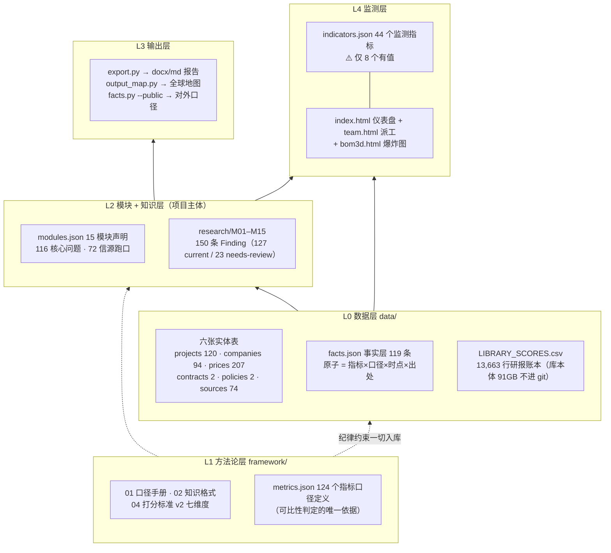
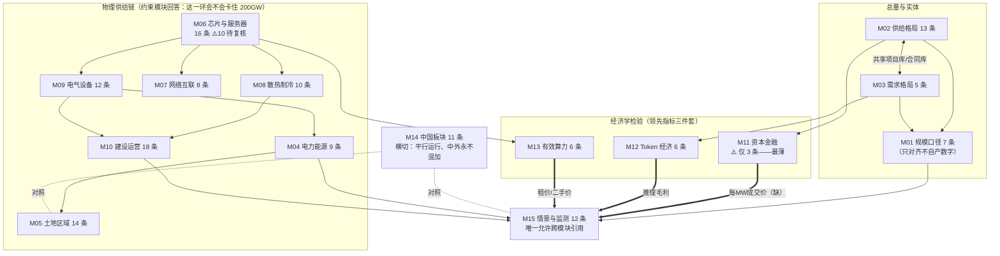
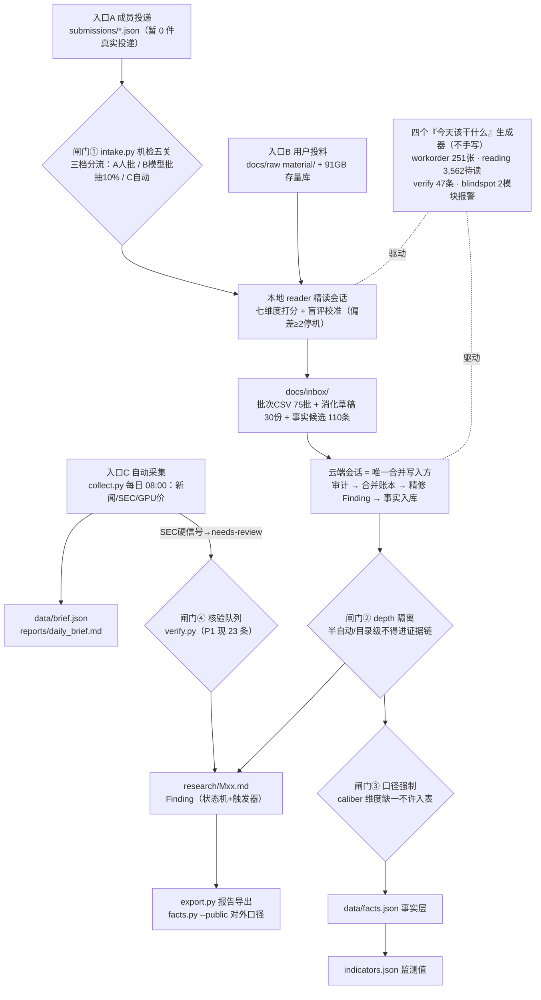
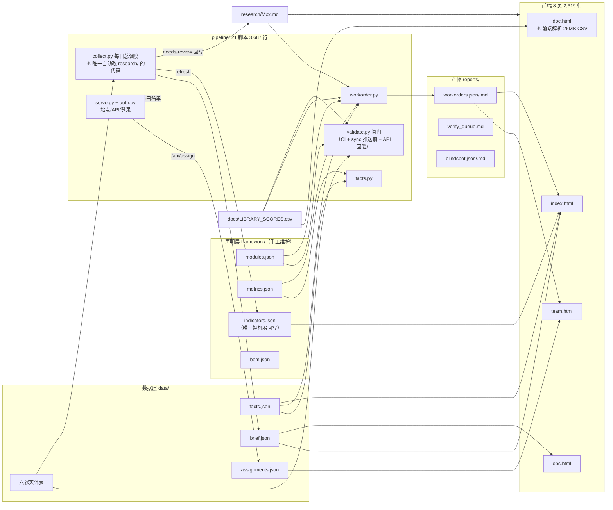
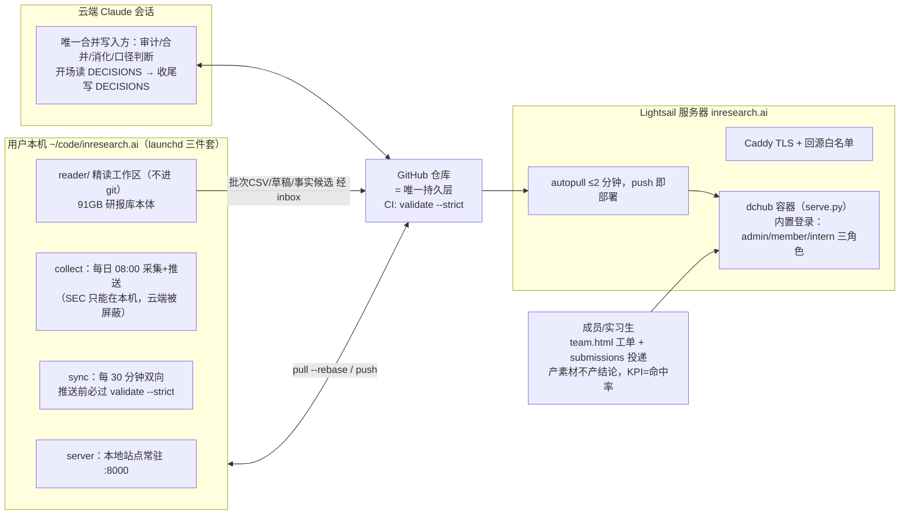

# 项目全景审读 — 代码与业务双视角（A to Z）

> 2026-09-06补充：本文为08-18的历史快照，统计与待办不代表当前状态。用户现明确以
> 全行业专家研究、逐级3D与材料同步、双向资料任务为目标，已形成新的
> [架构对齐草案](reviews/2026-09-06/RESEARCH_ARCHITECTURE_V2.md)。草案重新评价本页
> “15模块严格MECE/框架不变/主要只需填充”的前提，尚未切换正式框架或产品数据。

> 生成于 2026-08-18。目的：把整个项目**讲清楚、画清楚**——先还原它是什么、有什么、怎么运转，
> 再从**代码工程**与**生意/研究事实**两个独立视角给出观察与建议，供后续优化拍板。
> 方法：三路并行全量精读（21 个 Python 脚本 + 8 个 HTML 页 + 全部框架/知识/数据文件 +
> 13,663 行打分表统计），关键论断（Finding 计数、编号重复、指标覆盖率、安全疑点）已逐条独立复核。
> 所有数字均为当日实测，非转述。

---

## 一、这个项目是什么（一页纸）

**对 AI/智算数据中心生态的持续研究系统**。它不是一份报告，而是三层资产：
**数据积累（越久越值钱）+ 方法论体系（口径纪律）+ 多形态输出能力**。核心思想一句话：
**数据在变，框架不变**——15 个 MECE 模块是稳定骨架，材料持续流入、按纪律入库，报告只是导出物。

它回答的终极问题是三合一：

1. **200GW 叙事能否成立**（M12 需求侧经济学是最终检验）；
2. **如果成立，会卡在哪一环**（M04–M10 六个约束模块 + L1–L9 九级漏斗）;
3. **周期现在走到哪、什么信号出现要转情景**（M15 三情景 + M11/M12/M13 领先指标三件套，
   领先物理层空置率 12–18 个月）。

它区别于通用研究/RAG 的地方，是把「**不能把哪两个数放在一起**」变成了机器可校验的纪律：
四种口径永不混加、L8+ 才计当期供给、口径维度全等才可比、阅读深度四档永不混引、留白即纪律。

---

## 二、五张图

### 图 1 · 五层架构（L0–L4）

### 图 2 · 15 模块关系（数据流向）

### 图 3 · 一份材料的生命周期（防污染四道闸门）

### 图 4 · 代码数据流（谁读谁写）

### 图 5 · 三方协作拓扑

---

## 三、数据资产总账（2026-08-18 实测）

| 资产 | 规模 | 质量要点 |
|---|---|---|
| 研报库本体 | 28,759 份 / 91GB（本机，不进 git） | 触达率 100%（逐份 15,488 + 目录级 13,271）；已重组为 M01–M15 结构 |
| 打分表 LIBRARY_SCORES.csv | **13,663 行** / 26MB | depth：半自动 11,102（81%）/ 精读 1,204 / 目录级 1,007 / 据实生成 350；≥7 分仅 175 行（1.3%）；【敏感待判】454 行；⚠️ org 74% 未署名、629 行路径指向已迁移不存在的文件 |
| 知识层 research/ | **150 条 Finding** | current 127 / needs-review 23（M06 独占 10 条积压）；M10 最厚 18 条、M11 最薄 3 条 |
| 事实层 facts.json | **119 条** | 精读 116 / 据实生成 3（分界线执行严格）；⚠️ 114 条 corroboration 缺省「待交叉验证」——按自家规则暂不参与推算 |
| 指标 indicators.json | 44 个声明 | ⚠️ **仅 8 个有值（18%）**——预警仪表盘目前近于空转 |
| 指标口径 metrics.json | 124 个定义 | 事实层可比性判定的地基，设计完成度高 |
| 实体表 projects.json | 120 条 | 静态字段 100%；⚠️ capacity_it_mw 20%、status_history 12%、power_status 7%——聚合类指标算不动的根因 |
| contracts / policies / assignments | 2 / 2 / **0** 条 | 三张近空表；派工系统建好、零流量 |
| 工单 workorders | **251 张**（P2 243 / P3 8 / P1 0） | = 声明 − 现状 自动生成；M11 最多 23 张 |
| 队列 | 待精读 3,562 / 待核验 47（P1 23）/ 盲区报警 M03 6.2×·M11 5.2× | 消化积压是最大存量债 |
| 收件箱 inbox/ | 批次 75 个 14,882 行（未按约清空）、草稿 30、事实候选 110 条、加密包 362 待解压 | 本地↔云端交接层运转正常 |
| 明确的洞 | 151 份 image-only PDF 未读、LIBRARY_INDEX.md 停在 08-15 旧结构（17,843 份 vs 现 28,759） | 已登记，未处理 |

---

## 四、代码角度的观察（视角一）

### 4.1 量化画像

| 维度 | 数字 |
|---|---|
| 总量 | 核心 **6,306 行**（Python 21 文件 3,687 + HTML 8 页 2,619）；含 CI/部署/脚本约 6,800 行 |
| 头部 | intake.py 427 · workorder.py 411 · serve.py 384 · auth.py 369（四文件占 Python 43%） |
| 依赖 | **零依赖铁律严守**：运行时全标准库；唯一可选第三方 python-docx（缺失优雅降级）；three.js 已本地化 vendor |
| 重复率 | 估算全项目 **~15%（约 950 行）**：Python 8–12%、HTML 20–25% |

用 6,300 行支撑起「声明式工单 + 口径校验 + 事实层 + 认证 + 五个前端」，**工程纪律显著高于同规模项目应有水平**（内容哈希工单号、确定性抽样、--selftest 自检夹具、声明防分叉比对都是亮点）。债集中在两处：**前端跨文件复制**与**大 CSV 前端解析**。

### 4.2 冗余清单（主要项）

- `ROOT = Path(...)` 样板 20/21 个脚本各一份；裸 `json.loads(read_text)` 39 处、三套近似的表加载函数。
- **同一业务常数两处声明**：保鲜阈值 validate.py:28 `FRESH_DAYS` 与 verify.py:30 `FRESH` 各一份且已轻微分叉——恰是本项目在 DECISIONS 里批判过三次的「两处声明必有一处是错的」模式，这次发生在自己代码里。
- **容量分桶（L8+/L6-7/L1-5）逻辑 5 份实现**（refresh_indicators / output_map / index / company / ops，ops 版语义还有细微分叉）。
- **Finding 标题/状态行解析正则 6 处**（export/verify/collect/workorder/company.html/report.html）——知识层格式协议散落在 6 个解析器里，改一处格式要同步 6 处。
- HTML 侧：调色板 `:root` 抄 7 遍、`esc()` 7 份**且实现不一致**（4 份不转义 `>`）、fetch 助手 7 份、世界地图投影整段重复 2 处、自写 markdown 渲染器 2 份、topbar 导航 6 页手写。

### 4.3 死代码/孤儿

bom3d.html:269 的 `lot` Mesh 创建后从未 add（确定死代码）；serve.py 任务白名单里 workorder/blindspot/intake/facts 四项**有 API 无 ops.html 按钮**，反向 `reader`/`map(PDF)` 两项在服务器上必然失败（macOS 专用路径）；**data/schema/ 八份 JSON Schema 无任何代码引用**（validate 全手写检查，schema 是纯文档，需防两者漂移）；build_library_index.py 无任何调用方；pipeline/README.md 把三个早已实现的脚本仍列「规划中」。

### 4.4 安全评估（auth.py/serve.py，纯标准库实现总体扎实）

做得对的：PBKDF2 20 万轮独立盐、`compare_digest` 防时序、用户不存在也跑哈希抹平枚举、HMAC 自足会话删用户即踢、实习生白名单而非黑名单、最后一个 admin 不可降、非本机地址强制开认证。

**发现一个真实可利用漏洞与三个薄弱点**（按严重度）：

1. **【高·✅已修 08-18】敏感文件封锁可被 URL 编码绕过**（serve.py `_gate`）：黑名单是对**未解码**路径做子串匹配，而静态服务会先 unquote。`/data/users%2Ejson` 不含字面 `"/users.json"`，可穿过封锁——**member 角色可借此取到全部密码哈希与会话密钥**。已改为 unquote + 归一 + 转小写后再判，8 用例测试全过。
2. **【中·⏳待 infra】登录限速可被 X-Forwarded-For 伪造绕过**：client_ip 信任 XFF 首项，而 Caddyfile 只做回源白名单、未重写 XFF——伪造随机首项即可绕过 5 次/5 分钟限速。**根治在网关层**：Caddy 须 `header_up X-Forwarded-For {remote_host}` 覆盖客户端伪造值（代码侧无法辨真伪 IP）。留给 infra 仓库会话。
3. **【中·✅已修 08-18】`_fails` 限速表无上界**：已加 `FAIL_TABLE_MAX=4096`，满表清过期 + 丢最旧，伪造海量 XFF 也不再慢速耗内存。
4. **【中·✅已修 08-18】collect.py 回写 research/Mxx.md 非原子写**：这是唯一自动改知识层原文的代码，写入中途被 kill 会截断 Finding 文件。已改 `atomic_write`（临时文件 + `os.replace`），brief.json/daily_brief.md 一并覆盖。

### 4.5 性能

**最突出**：doc.html 前端全量下载并字符级解析 26MB 打分表（13,663 行对象数组，每次筛选全量重算）——桌面卡顿、移动端可能直接崩，且入口暴露给实习生。其次：index.html 每 60 秒全量重 fetch 十余个 JSON 并整页重建 DOM；company.html/report.html 每次打开并发拉 15–16 个 research md 全文做正则。

### 4.6 建议（三档）

**值得做**（安全与最大性能点，均不破零依赖）：
① 修 URL 编码绕过；② Caddy 重写 XFF + `_fails` 加界；③ collect 回写改原子写；
④ doc.html 改走 serve.py 新增的分页 API（标准库流式 csv 过滤）；
⑤ 抽 `pipeline/common.py` 收敛 ROOT/表加载/days_since/容量分桶/Finding 解析/保鲜阈值单一声明；
⑥ 同步 pipeline/README 与 ops.html 任务清单；⑦ 删两处确定死代码。

**可做可不做**：抽 `assets/common.css` + 统一 esc/get（只抽无争议的）；verify/refresh 的 load 加 try 让 collect 单表损坏时降级；prices.json 写入加 fcntl 文件锁；schema 目录标注「文档用途」。

**别做**：前端框架/构建工具、jsonschema 等第三方库、Flask/FastAPI、数据库——负载画像（最重脚本 8.3s/48MB 内存）证明不需要，且违反刻意选择的零依赖与「仓库即持久层」。

---

## 五、生意/研究事实角度的观察（视角二）

### 5.1 总评一句话

**方法论完成度显著领先于数据完成度**：框架、口径、状态机、事实层的设计已到可对外讲述的成熟度，150 条 Finding 里有 20 条以上具独立发表价值；但 44 个监测指标仅 8 个有值、项目库 L8+ 聚合仅 5.9GW（对照全球 103GW 的口径）、M11 近乎空心——「数据在变，框架不变」目前只兑现了后半句。

### 5.2 护城河（真实存在的三处）

1. **口径纪律的机器化**：metrics.json「口径维度全等才可比、不可比拒绝并列并指出差在哪一维」——通用 RAG 做不到，且已在实战拦下真错误（上架率 17.7pp 陷阱、六安 vs 广州剥室外）。
2. **中国一手工程档案**：M10 的造价基线链条（广州三栋楼离散 <3.5%、跨省剥口径后差 1%）公开渠道不存在；M14 的「智算中心名实分离」「两套口径差 49%」是别处没有的解毒剂结论。
3. **Finding 状态机 + 触发器的保鲜能力**：SEC 硬信号自动把关联结论标 needs-review——报告是导出物而非终点，传统研报没有这个机制。

### 5.3 最有全局价值的结论（十条）

M12-F3 收入/承诺比 0.23–0.33（200GW 叙事最大裂缝的量化）；M15-F10/F11 券商假设利用率 80% vs 实测 <30%（中国智算投资叙事的单点脆弱性）；M02-F13 电力容量长约 $2.256M/MW/年（两笔独立合同交叉验算）；M12-F2 实现价 $0.99/M 而推理毛利 <40%→>70%（周期顶部尚远）；M15-F12 中美约束对称落在产能与交付；M14-F4+M05-F11 中国缺硅不缺电、美国缺电不缺硅；M04-F4+M09 设备交期是最诚实温度计（变压器 4 年、燃机 125GW vs 年产 20GW）；M08-F7 液冷买的是互连密度不是电费；M14-F9/F10 中国智算统计引用前必过检查；M13-F6 B200 典型负载利用率 <10% 的算术推导。

### 5.4 结构性短板（用数字说话）

1. **预警系统三只眼睛，一只没睁开**：框架自己宣布 M11/M12/M13 是三个最领先周期指标，而 M11 对 10 个核心问题只有 3 条 Finding，招牌指标「每 MW 成交价」零数据点——**对投资类客户这是他们唯一真正关心的第一数据**。工单最多（23 张）+ 盲区报警（5.2×）+ Finding 最少，三个信号指向同一个模块。
2. **数据层与知识层不对称**：结论 150 条很能打，但写作纪律要求每个大数字可追溯 record_id，而多数 Finding 证据挂在 URL 而非库内记录——严格按自家规则，**现在导出即违规**。事实层 119 条里 114 条「待交叉验证」，可参与推算的极少。
3. **81% 打分表是索引不是知识**：半自动 11,102 行须回原文复核才能上证据链；待精读 3,562 份对已消化 68 份，按现有人力吞吐是数月级积压——**库里缺的早已不是材料，是精读**（这与「消化积压压倒采集缺口」的既有判断一致，且在放大）。
4. **团队化只有基建没有运营**：投递契约、机检五关、三档分流、派工 API、三角色权限全部就绪，但真实投递 0 件、派工记录 0 条、251 张工单无一张已派。第四阶段的瓶颈已不在系统，在人员到位。
5. **卫生债直接伤害核心卖点**：M07-F5/F6、M08-F8 编号各重复两次（违反「Finding ID 永不复用」铁律）、M04-F8/M12-F6 跳号无说明、三条 xlsx 草稿格式破坏机器解析、SUMMARY.md 停在 68 条（实际 150）、LIBRARY_INDEX 过期两代——**一个以纪律为卖点的产品，自己的格式违例是最贵的 bug**。
6. **情景校准从未运转**：M15 声明「季度校准留档，校准记录本身是资产」，至今零次。
7. **回音室风险自知未解**：看空方严肃材料库内不足（M15-F9 待办自认）；M14 关键量化多为 SemiAnalysis 单点依赖，缺中文一手交叉验证。

### 5.5 可行性判断

天然付费客户画像清晰：**数据中心投资/信贷方**（M11 每 MW 成交价、期限错配）、**供应链厂商战略部**（M06–M09 交期与技术切换）、**中国算力政策与投资参与者**（M14 差异化资产）。离对外交付的距离按重要性排：① 补 M11；② 事实层 corroboration 铺开 + 大数字挂 record_id；③ 导出管线（reports/templates 尚不存在，facts.py --public 的对外三条规则已设计好但没有载体）；④ 清卫生债与 23 条复核债（M06 的 10 条恰是外部读者最想看又变得最快的部分）；⑤ 至少一次完整的情景校准留档作为样例。

---

## 六、双视角交汇：建议的优化次序

两个视角指向同一个结论：**系统的骨架已经建成且质量高于规模应有水平，当前的主要矛盾是「填充与运营」而非「再建设」**。建议按下列次序推进（P0/P1 代码侧动作小、独立可做；P2/P3 是业务主线）：

| 档 | 事项 | 依据 | 量级 |
|---|---|---|---|
| **P0 安全** | 修 URL 编码绕过；Caddy 重写 XFF + 限速表加界；collect 回写原子化 | 站点已对外、member 可取到密码哈希 | 各几行～几十行 |
| **P1 卫生债** | Finding 编号重复/跳号修复 + 三条草稿格式规范化 + SUMMARY 重算 + LIBRARY_INDEX 重建 + 629 行死路径清理 + README/ops 任务同步 | 纪律是核心卖点，违例最伤可信度 | 一个会话 |
| **P2 代码收敛** | pipeline/common.py（分桶/保鲜阈值/Finding 解析收成一处）；doc.html 打分表分页 API；调色板与 esc 统一 | 消掉 ~950 行重复、解决最大性能点 | 一两个会话 |
| **P3 业务主线** | ① M11 补厚（三只眼睛睁开第三只）② needs-review 23 条复核 ③ 实体表动态字段（capacity 20%→50%+，contracts/policies 脱空）④ 事实层 corroboration 铺开 ⑤ 导出管线首版 ⑥ 团队化通水（首批真实投递+派工） | 第五节 5.4 的七条短板 | 持续 |

> 说明：本报告只做观察与建议，未改动任何代码与数据。P0–P3 的执行需另行拍板排期。
