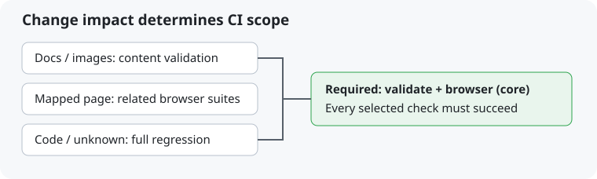

# CI 影响范围调整交接 · 2026-10-10

用户授权将小图片与文案分流，并同步规则和必过设置。实现入口 scripts/ci_scope.py，规范唯一源 docs/CI.md。变更机制自身属于 full；上线须保留最终 head 全套 CI 回执后再收敛 GitHub 保护名单，保留 validate/browser (core) 两个已有名称和 app_id 15368、enforce_admins=true。

已同步 AGENTS、CURRENT、DECISIONS、current_state、verification_contract、研究发布器与相关测试。内容路线仅启动 scope、validate、browser(core) 三个作业；已映射页面文字/模型图像加对应浏览器，完整路线保留全部 17 分片和 storage-container。取消同一 PR 旧 head 的运行；手动与每日北京时间 02:17 全套。

发布器两个必过上下文必须成功，可选 skipped 仅在汇总门禁成功时可接受。已有完整四检查 PR 满足保留的两个名字。没有重启 Reader、研究队列或修改正式研究数据。GitHub 保护与实际执行结果另以实测回执补充，不以本文件存在冒充已上线。

## 实际上线回执

- [PR #604](https://github.com/niuroumiantt/InResearch.ai/pull/604) 已于 2026-10-10 11:38:31 UTC 正常受保护合并，main 提交 `0d5695387e45075e7faef4e217a7242e51766942`。最终候选 `d78a262bb449dd9d851653db0bafe1b9c0e00557` 的 [全套运行 38048523497](https://github.com/niuroumiantt/InResearch.ai/actions/runs/38048523497) 21 项全部成功；整合 BOM 后本地 2,158 项单元回归、治理/严格数据/registry 通过。
- GitHub main 必过检查已实测为 `validate`、`browser (core)`，均绑定 GitHub Actions app_id `15368`；`enforce_admins=true`，strict 与其他保护设置保持。原来的 model_assets/storage-container 由影响范围决定是否执行，执行时仍必须成功。
- 本回执和下图构成真实“小图片＋文案”验收提交；预期 mode=content、三个作业执行成功、浏览器/容器作业跳过。只有实际 GitHub 运行结果可证明轻量路线通过，不以此预期替代运行证据。
- 本机完整设置前后值、运行作业与合并回执保存在 `~/.local/state/inresearch.ai/ci-rollout/20261010-impact-scoping/`。未改动 Reader/研究队列的运行服务。

