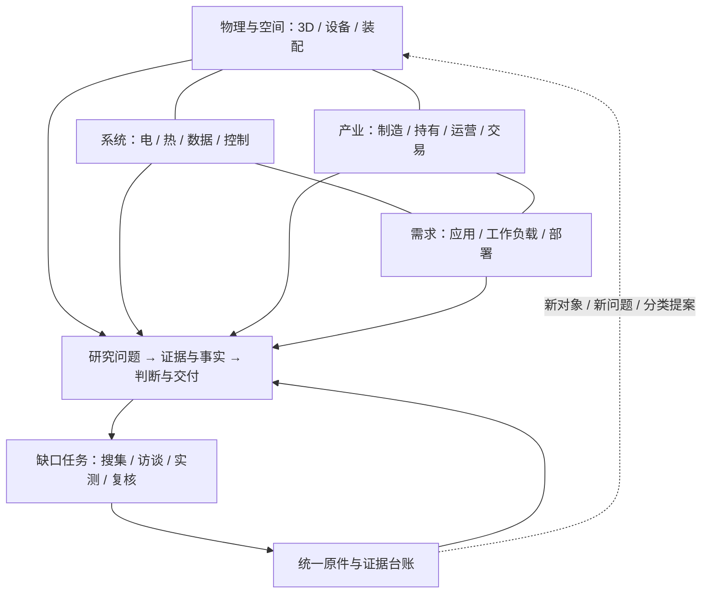

# 数据中心全行业研究架构 v2：用户采用与实施基准

2026-09-06｜状态：用户已采用，作为今后研究架构与实施基准。

> 采用说明：用户在本稿形成后批准按此架构推进，并要求同步代码、仓库、服务器与 PDF。为保留完整设计论证，下文“提案”“建议”“本轮不启动”“尚未实施”等表述保留为制定时的历史状态，不再表示架构待批准；也不表示所有实现已经完成。现行执行标准见 `framework/00_overview.md`、`framework/03_bom_and_collaboration.md`、`framework/04_reading_scoring_standard.md` 与 `docs/local_reader/RUN_TO_COMPLETION.md`。具体代码、数据迁移和服务运行状态以验收及部署记录为准。现行口径、原件保留和 C3 采用门槛保持。

本稿依据用户本轮目标、两张附件、现有 `PROJECT_PANORAMA.md`、研究框架、BOM与代码审阅提出。附件中的规则和预测作为待评价内容，不自动视为用户已批准的规范。用户要求先对齐架构，再导入资料和分配任务；本轮不启动迁移或常驻读取服务。

## 1. 研究目标与需要改变的前提

用户希望对整个数据中心行业及前后供应链持续开展深入、多角度研究，逐步成为能够独立解释、比较、验证与交付判断的行业专家。3D爆炸应深入真实设施与设备，每层材料、研究问题和成果同步细化；框架驱动主动补材料，新增原料也能反过来补充和改进框架。

现有体系值得保留的是稳定ID、来源定位、事实口径、结论状态与触发器，以及“物理部件轴＋研究角度轴”。需要调整的前提有：

1. **范围**：旧全景报告以“200GW叙事能否成立、哪里卡住、周期走到哪里”为中心。这是一个重要专题，不能覆盖技术原理、通用IT负载、工程设计、运行可靠性和生命周期的全部研究。
2. **分层**：15模块把物理对象、地理区域、经济问题和综合方法放在同一层，不能作为唯一的严格MECE分类树；它们适合保留为已有研究工作流和导航入口。
3. **连接**：当前BOM v1.2有46个节点，字段主要是layer、module、companies、series、indicators、status与部分upstream，尚未把空间、装配、接口、具体型号、站点实例和原文证据连接成完整模型。
4. **框架演进**：“框架永远不变”建议改成“身份稳定、边界明确、变更可追溯”。新技术和新材料可以提出新分支；旧数据不因改分类而丢失身份或被重新解释。
5. **综合**：建议允许任何课题有来源地引用其他课题结论，记录依赖与冲突；M15负责全局情景综合，但不再是唯一可跨模块思考的地方。此项属于正式规则变更建议，尚未应用。

## 2. 总体结构：一份知识底座，五种互相连接的视角

| 视角 | 所回答的问题 | 主要对象/关系 | 对应已有资产 |
|---|---|---|---|
| P 物理与空间 | 东西在哪里、由什么组成？ | 空间、设备、装配、型号、站点实例 | BOM、3D、产品目录 |
| F 系统与接口 | 电、热、数据与控制怎样流动，如何相互约束？ | 端口、连接、系统成员、依赖、故障域 | M04/M07/M08/M09/M13中的部分研究 |
| V 产业与交易 | 谁设计制造、供货、持有、运营、使用、付费并承担风险？ | 公司、业务活动、产品、合同、资产权利 | 附件DC三层、公司/合同/项目库 |
| D 需求与工作负载 | 什么业务需要什么性能，如何形成设备与设施需求？ | 应用、服务、工作负载、部署与采购 | 附件LLM四层、M03/M12/M13 |
| R 问题与证据 | 我们想证明什么、知道多少、缺什么、如何交付？ | 问题、原文证据、事实、判断、模型、任务 | 15模块、facts、Finding、工单 |

区域、时间、生命周期、法规、可持续性等作为贯穿这些视角的条件。每类仍有明确研究负责人，不能因为称为“横切”就不派工。视角之间共享记录，不各建一套相互矛盾的数据库。



这里的P/F/V/D/R是视角标识。界面不再把物理深度、产业层、软件层与项目成熟度都写成没有前缀的L1/L2。旧ID保留映射，避免改显示名称导致历史引用失效。

## 3. 两张附件怎样接入，哪些地方需要修正

### 数据中心三层图

保留其区分资源设施、硬件供给和算力资产经营的价值，建议命名为 **DC-V1／DC-V2／DC-V3**，明确这是业务活动视图，而非3D深度。

| 附件内容 | 对齐后的处理 |
|---|---|
| V1运营与资源：资源能源、建设、托管运营 | 保留；内部区分资源/权利获取、设计建设、设施运营与托管服务。开发商、资产所有者、设施运营商、租户可不同 |
| V2硬件：算力、存储、网络、机电配套 | 保留；各域再分材料/器件/组件/系统/集成/渠道及维保业务。设计、晶圆制造、封测、设备和材料形成上游关系，不能只写在GPU描述的一段文字里 |
| V3算力资产：持有、自用/出租、流转 | 保留；分别记录产权、租赁使用权、运营控制和对客户的服务承诺。自用也产生需求，但不虚构外部销售收入 |
| 每个实体只有一个归属 | 改为每个有边界的业务活动有主归类；同一公司可以多角色，同一资产也可由不同主体持有、运营和使用 |
| 公司库独立成库 | 保留单一公司身份，关联法人/子公司/业务分部和有起止时间的角色；“主业”只用于展示，不决定能参与哪些关系 |
| HBM、SSD、存储服务合放“存储” | 导航可同域，内部明确工作内存/加速器内存、持久介质、存储系统及数据服务的差异，不能横向混比容量、价格与收入 |
| EPC/机电制造、冷却/配电设备跨层 | 制造设备的活动归V2，采购、施工、集成和运行的活动归V1；合同拆不清时保留综合包，不凭空拆收入 |

层之间是关系网络，不能把V1收入、V2收入和V3收入直接相加当行业最终市场规模。统计前明确终端支出、供应链收入、增加值或资产存量，记录内部交易及合并抵销边界。设备出售收入与后续服务收入也不能混成同一存量指标。

例如，NVIDIA的H100 SuperPOD参考架构明确包括客户自有或商业托管设施中的客户服务器，也包含软件和多种网络；这说明设施关系与IT资产关系需分开。[NVIDIA参考架构](https://docs.nvidia.com/dgx-superpod/reference-architecture-scalable-infrastructure-h100/latest/dgx-superpod-components.html)

### 大模型四层图

建议作为关联需求域，命名 **AI-D1要素／AI-D2模型／AI-D3部署与服务／AI-D4应用**。模型厂商、API厂商和应用厂商仍按具体业务挂角色，不能把某家公司固定塞一层。若未来完整研究模型产业，可以独立扩展它的对象和问题，使用共享证据连接数据中心研究。

数据中心侧需要一个明确的传导接口：

```text
应用规模与服务要求
  → 工作负载（训练/后训练/推理；以及数据库、存储、HPC等）
  → 性能目标（吞吐、延迟、可用性、精度、容量、数据移动）
  → 部署与软件策略（模型、并行、调度、缓存、批处理、量化）
  → 有效资源需求（计算、内存、存储、网络）
  → 集群/机柜设计 → 电力、冷却、空间与建设需求
  → 采购、合同、成本及运行反馈
```

不设统一的“Token→GPU→MW”常数。相同Token数在模型、输入输出长度、批量、延迟要求和硬件软件配置不同时，所需资源不同；训练、推理、一般IT也需各自口径。工程情景可以估算，但与观测事实分层保存，不拿情景推算补官方未披露的项目容量。

附件里的“Agent耗量几十几百倍”“训练是最大需求方”等暂作研究假说，须有对象、时点与测量口径才能采用。传统企业IT、数据库、数据分析、内容/存储服务、HPC和非生成式AI保留入口，不能因LLM图完整就认为需求研究已穷尽。LBNL的2024报告分别建模传统与AI专用服务器，支持区分这类负载边界；不把该报告当作2026年设备现状。[LBNL报告](https://doi.org/10.71468/P1WC7Q)

## 4. 3D的分层：空间树、装配树、系统连接分别存在

面向读者可以沿着下列尺度逐级打开，但底层关系必须注明类型：

| 观察尺度 | 对象示例 | 关系与必要边界 |
|---|---|---|
| 区域/市场背景 | 电力区、集群市场、网络覆盖、气候与法规 | 地理/市场背景，不当作机房BOM组件 |
| 园区 | 建筑、室外设备区、道路与管廊 | 空间包含；外部电网、水权、运营商线路是边界连接或权利 |
| 建筑/区域 | 楼层、机房、电气室、泵房、屋顶设备区 | 位置与空间关系；室外设备不强制经过建筑层 |
| 房间/部署区 | 机柜位置、行列、冷热通道、设备安装点 | 空间布置；跨房间集群和冗余故障域另记 |
| 机柜/整机 | 机架、服务器、交换机、CDU、UPS、泵组 | 设备实例；并非所有设备都必须放在机柜里 |
| 托盘/组件 | 计算托盘、主板、电源模块、冷板组件、换热器组件 | 装配/可更换单元 |
| 器件/封装 | 加速器封装、HBM堆栈、VRM器件、连接器、阀与密封件 | 特定型号下的实际组成，不凭通用图推断所有型号 |
| 材料/工艺 | 导热界面材料、铜材/镀层、基板、制造与连接工艺 | 材料组成与制造关系；上游工厂不属于该数据中心空间 |

空间树回答“放在哪里”，装配树回答“装在什么里面”；功能系统跨越它们：

- 电：外部接入→站内变换/保护→分配→设备电源→板级供电，带备电与冗余支路。
- 热：芯片/器件→导热界面→冷板/空气→机架/设施回路→最终排热，具体回路按方案标注。
- 数据：芯片互连、计算网络、存储网络、带外管理网络、DCI/WAN，分别标端口与协议。
- 控制：传感、执行器、固件/BMC、DCIM/BMS、调度与应用反馈；实体设备和逻辑服务分别建模。

一台CDU可以服务多个机柜；冷板冷却GPU，不表示GPU是冷板的子件。水、电、网络连线应连接端口，并记录介质/电压/协议、容量范围、方向和适用版本。OCP冷板工作明确关注从冷板到CDU的技术冷却系统及其接口；支持把接口作为独立研究对象。[OCP冷板项目](https://www.opencompute.org/community/cold-plate)

### 完整覆盖的首版检查域

下面是检查清单，不宣称是一棵天然互斥的实物树。按实际对象和关系登记，避免同一设备出现多份事实：

| 域 | 首层需检查的内容 |
|---|---|
| 资源与场址 | 电力接入、能源与燃料、水、土地、环境与许可、外部通信条件 |
| 建筑与土建 | 结构、承载、围护、空间、管廊、抗灾、施工组织 |
| 供配电 | 变换、保护、开关、配电、UPS/储能、备电、接地、电能质量、板级供电 |
| 热管理与流体 | 风冷、液冷、换热、泵阀、管路、快接、冷媒/水质、排热、余热与检漏 |
| 计算与内存 | CPU/GPU/ASIC/FPGA、主板/托盘、内存层次、互连、固件与机架集成 |
| 存储与数据服务 | 介质、控制器、阵列/分布式系统、文件/块/对象、备份归档、数据移动 |
| 网络与互联 | 交换/路由、光/电互联、布线、带外管理、DCI/WAN、时钟同步 |
| 安全与管理 | 消防、物理安防、监控控制、身份/硬件安全、审计、运维工具 |
| 软件与负载运行 | OS/虚拟化、编译与驱动、集群编排、调度、性能观测、服务质量与容错 |
| 生命周期与交付 | 设计采购、建设调试、运行维护、故障恢复、升级替换、退役回收与再利用 |

OCP也将设施与物理基础、IT基础、系统管理和跨域安全/可持续性区分组织；可用作外部漏项对照，而不把其社区组织图直接当本项目唯一分类。[OCP项目目录](https://www.opencompute.org/projects-new)

### 真实度与方案差异

每个模型或节点标明：概念示意、官方参考设计、某项目设计、竣工核对、运行核对；记录型号、配置、日期与依据。视觉精细度、设备身份可信度、资料完整度分开显示。没有真实资料的内部构造保持未知，不能用精美几何冒充已核实结构。

通用风冷、液冷AI集群、托管设施和边缘部署是可组合的配置条件，不是四个互斥行业。设施规模、商业模式、负载、散热方式和冗余方式分别配置；同一站点可混合。Uptime把基础设施拓扑与运营可持续性分别评价，也不把某个Tier等同于某种固定设计；因此不能从一张3D图推断运维能力或认证等级。[Uptime说明](https://uptimeinstitute.com/tiers)

## 5. “穷尽且互斥”怎样变成可执行规则

1. **先定义全集**：这个项目/型号/配置/时点下包含哪些空间、设备和业务。全球行业所有未来形态不可能一次枚举完，以明确边界内的覆盖和未知清单检验完整性。
2. **同级只用一个划分标准**：例如按装配组成拆主板，不能把“GPU、液冷、NVIDIA、中国”并列为四个子件。
3. **实例只登记一次**：一个物理实例在同一装配视图和时点只有一个直接装配父项；位置另记，服务多个系统用关系。型号类型可以出现在多种产品组合中。
4. **数量口径明确**：物理BOM数量与采购套件数量分开；子项成本已含在父项采购价时不重复加总，冗余设备和运行容量也不混算。
5. **一份事实、一位维护责任人、多个用途**：证据和事实可以支持多个问题，不复制事实或把模块边界变成信息孤岛。合作成员可以多人，最终责任明确。
6. **材料多重关联**：一份报告可覆盖园区、机柜和冷板，但每个关联要有具体页/节，注明直接研究、背景、实测、反证或仅提及。父节点有报告不自动表示所有子节点有证据。
7. **未知是一种显式状态**：未覆盖、解析失败、冲突、过期、待分类与不适用分开。新增分支有理由、边界、来源、映射和版本，不由模型每篇随意造目录。
8. **深度由研究价值驱动**：当继续拆分能改变性能、成本、故障、可替代供应商、制造瓶颈或兼容性判断时继续；其余登记待深入，不为了节点数量追求无限拆分。

## 6. 每个研究节点的统一档案

每个节点至少有下列八组内容。节点可以是设备，也可以是接口、工艺、商业活动或工作负载；问题模板按类型裁剪，不硬填不适用栏目。

| 内容 | 要回答的研究问题 | 合格产物示例 |
|---|---|---|
| 定义与边界 | 它是什么、解决什么问题、适用哪些配置？ | 可核查定义、结构图、型号与版本边界 |
| 原理与接口 | 怎样工作、与哪些系统交换什么？ | 原理说明、接口图、关键参数及测量条件 |
| 方案与替代 | 有哪些技术路线，何时选哪种？ | 同条件比较表、适用/失效条件 |
| 性能与可靠性 | 瓶颈、故障、测试、维护与寿命是什么？ | 基准与测试方法、故障模式、运行案例 |
| 供应链与主体 | 谁设计、制造、集成、交付，替代需要什么？ | 有时点的角色关系、产品/产能/认证证据 |
| 经济与交付 | 采购、交期、安装、运行、退役的成本和风险如何？ | 口径明确的成本/价格/交期与情景分析 |
| 证据与判断 | 原文在哪里，哪些已确认、冲突或未知？ | 证据定位、事实、结论、可证伪条件 |
| 缺口与任务 | 下一个最值得回答的问题是什么？ | owner、任务、验收、依赖、复核触发器 |

3D、阅读目录、公司页、研究报告共享这些ID和关系。点击设备应能到达“结构→方案→参数→供应商→原文→判断→缺口”，点击一篇材料也能反查它支持哪些节点与问题。

## 7. 从园区到冷板：逐级材料如何同步细化

以下为设计样例，不表示这些资料已在库内，也不代表某个已核实站点。

| 尺度 | 示例问题 | 应寻找的材料 | 合格交付 |
|---|---|---|---|
| 园区 | 给定场址能满足什么负载与扩展目标？ | 场址约束、接入文件、总图、资源条件、建设阶段说明 | 有来源的资源边界与分期图，未披露容量留空 |
| 建筑/机房 | 承载、消防、流体与电气方案能支持怎样的布置？ | 设计说明、平面图、承载资料、电气单线图、P&ID、测试/调试资料 | 接口与限制清单；设计与竣工差异单列 |
| 机柜 | 某配置的设备组合、供电和供冷怎样匹配？ | 官方机架规范、设备BOM、功率/流量条件、歧管和接口资料 | 有配置版本的机柜档案，声明与实测分开 |
| 托盘/服务器 | 热源分布、供电、内存与互连如何制约性能？ | 服务手册、官方布局/拆解、板级框图、基准方法和维护资料 | 子件/接口图、性能与维护的适用条件 |
| 冷板组件 | 特定热负载下如何平衡散热、压降与可维护性？ | 结构/尺寸图、热阻与压降测试、材料兼容、密封和可靠性资料 | 同工况方案比较；缺少工况不直接排名 |
| 材料/工艺 | 流道、铜材/镀层、界面材料和密封怎样影响效果与寿命？ | 制造工艺、材料测试、腐蚀/污染/寿命报告、失效分析 | 机理、供应约束、验证计划与未知清单 |

同一冷板节点还可横向查看：与GPU的热接口、与歧管/CDU的流体接口，制造/集成/采购主体，负载变化的影响，及M08/M06/M10/M11等关联研究。CDU到冷板的回路不是“冷板的装配祖先链”。

## 8. 资料分类必须精细到“证据支持什么”

Spark的文档记录拟在上一轮深读契约之外新增：`object_ids`、`question_ids`、`relation_ids`、`evidence_links`、`coverage_scope`、`taxonomy_version`、`new_object_proposals`、`new_question_proposals`。

每条关联包含文档版本、页/节/表/图/单元格、对应对象或关系、支持的具体主张、关联性质和核验状态。解析缓存键不能代替source_id；整个文件归档名称也不能代替证据定位。

**非数字知识有正式身份。** 现有数字型fact继续保持指标/数值/单位/口径语义；建议另用稳定statement_id记录定义、规范要求、结构关系、机制解释、事件、测试结论、预测与假设。每条有类型、主体/关系引用、适用条件、文档版本与证据、支持/反驳关系及采用状态。“作者声称X”与“已核实X”分别表达。原理、接口约束和失败案例不会因为数字密度低而被排除。

必须区分以下情况：

- **直接解释**一个部件原理，能支持定义问题；
- **实测**某型号在某工况下的性能，支持有范围的数值判断；
- **提及**某部件，只作为检索线索；
- **上层方案资料**给出下层接口要求，但没有解释下层内部构造；
- **反证/冲突**值得保留，不因不支持当前结论降低资料价值；
- **全篇深读无新增**完成阅读，但不增加研究完成率。

原件只保管一份身份，视角和目录是可重建的浏览方式。初始物理文件夹可以保持粗而稳定，细分依靠节点ID与证据关联；以后调整分类不会要求重新阅读每一篇或复制多份原件。

## 9. 从上到下与从下到上的闭环

### 框架驱动任务

```text
对象/关系边界 → 研究问题 → 所需证据与验收方法
  → 对照已核证据 → 形成缺口 → 找资料/访谈/实测/复核
  → 事实与判断 → 节点档案、3D关联、专题交付
```

先搜索内部已读材料，再决定外部采集。工单不能只是“找十篇液冷报告”；应明确比较对象、工况/时间/区域、所需证据、交付物、验收、责任人与依赖。一个新文件到达不自动关闭工单，须证明它满足该问题的验收条件。

### 材料驱动研究

```text
raw-materials → 登记与完整性检查 → 27B粗读 → 每篇深读
  → 提取对象/接口/主张/条件/页码
  → 匹配现有节点与问题 → 证据候选 → 核验/采用
  → 补齐既有任务，或提出新对象、新关系、新问题与冲突
```

匹配不到不硬塞入最相近文件夹，进入带理由的待分类提案。新概念优先判断是否为别名、型号、实例、关系、方案条件，最后才考虑新增分类。框架变更按版本迁移，来源与已完成阅读不丢失；全文深读要求保持，不重新引入低分淘汰。

研究采用沿用现行C3及口径要求，见 `docs/DECISIONS.md` 和 `docs/local_reader/CONTINUOUS_READER_DESIGN.md`：深读完成、结构化抽取、原文核验、研究采用分别记账。本轮未放宽中外聚合、未经核验数值参与推算或A档审阅要求；设计草案中的情景研究不能绕过这些规则进入核心事实。

### 第一组可派任务样例

| 任务 | 明确交付 | 完成条件 |
|---|---|---|
| 验证一个官方机架配置的装配树 | 型号/版本BOM、每项出处、父子关系和未知项 | 无循环/重复实例，数量口径与原图一致，未知不补猜 |
| 核对机柜到CDU的流体接口 | 端口、回路、流量/温度/压差条件与资料 | 关系不误写父子，参数全部能定位且工况明确 |
| 比较两类冷却路线的适用边界 | 同约束比较、反例、成本和维护差异 | 不用不同工况单点数字直接排名，结论可复算/复查 |
| 解释一个负载的设施需求 | 性能目标→部署→资源→设施链及输入表 | 假设与观测分开，利用率口径清楚，结果只作情景 |
| 画出托管场景的权利与交易 | 设施、服务器、运营/使用/支付关系 | 同资产只登记一次，主体角色有来源与时点 |
| 用原始材料挑战一条旧判断 | 支持/反证、口径差异、修改建议 | 不以资料数量投票，清楚写出什么证据会改变判断 |

## 10. 进度与专家能力如何衡量

不要把文件数、摘要长度、节点数量或3D精细程度合成一个“研究完成度”。分别记录：

- **对象覆盖**：已列明边界内，哪些设备、接口、业务与负载有档案，哪些仍未知。
- **证据覆盖**：关键问题有原文定位、独立性与工况说明的证据比例；未读取/冲突/过期单列。
- **问题完成**：暂定回答、已验证、存在争议、等待数据、过期需复核；每个有验收标准。
- **应用能力**：能否在新案例上解释结构、比较方案、复算模型、定位故障/瓶颈并作条件化判断。
- **交付能力**：节点档案、技术方案比较、公司供应链研究、场址/项目案例、情景与周期报告能否按需求导出。

每轮冻结scope_version、适用节点、必答问题及分母，新增范围另记版本，避免用大量易答小问题抬高覆盖率。关键问题未通过时直接显示关键缺口，不能用平均数掩盖。新反证、产品配置变更或来源被修订，应沿依赖关系把受影响答案、模型与交付物转入复核；样板必须验证这一回流。

建议以“解释→比较→验证→预测/判断→回顾”形成个人研究循环：读完后脱离摘要复述原理；做至少一种替代方案对比；用手册、实验/运维记录或行业访谈检验；对未来变化给出有触发条件的判断并定期复盘。数量目标只是工作量，不能代替这些能力。

研究架构为主动学习服务：保留术语/原理基线、经典材料、实践案例、争议清单、预测回顾和未解问题。资料处理可以持续自动运行，研究判断需要独立原文抽查和现实反馈；不能让同一个模型的多轮摘要互相证明。

## 11. 数据实现原则与渐进落地

### 11.1 旧15模块的完整去向

以下是模块级映射；116条旧问题目前均为字符串，逐条赋予稳定问题身份及迁移状态属于后续实施，不能把此表当作数据已迁移。

| 原模块 | 新体系中的主要位置 | 深化方向 |
|---|---|---|
| M01 市场规模与增长 | 需求/设施的口径与聚合视图 | 明确总体、样本、存量/流量、阶段和估计误差 |
| M02 供给格局 | 设施、部署、开发/持有/运营关系 | 多角色共享一个资产身份，区分规划与运行 |
| M03 需求格局 | 客户、工作负载、服务与合同 | 传统IT与AI并列，意向/签约/交付/使用分列 |
| M04 电力与能源 | 资源、电力系统与边界接口 | 补原理、电能质量、运行与失效机制 |
| M05 土地与区域 | 空间、场址、制度与资源条件 | 引用电水网等系统证据形成选址比较 |
| M06 芯片与服务器 | 计算/内存/存储装配、型号、上游工艺 | 拆开粒度并补通用IT、配置和工程参数 |
| M07 网络与互联 | 网络系统、端口、器件及通信服务 | 拓扑/协议/介质分开，研究性能与故障域 |
| M08 散热与制冷 | 从热源到环境的热/流体关系 | 接口、材料、维护与失效，并比较同条件方案 |
| M09 电气设备供应链 | 供配电设备与制造/交付活动 | 工程架构和设备供需分别研究、相互引用 |
| M10 建设运营与人才 | 生命周期、服务活动、运行事件 | 扩展设计验证、调试、维护、故障与退役 |
| M11 资本与金融 | 权利、合同、融资、资产与经济模型 | 保留独立责任，区分价格/租金/融资/收入 |
| M12 需求侧经济学 | 服务价值、采用与工作负载经济性 | Token专题之外保留其他服务单位和需求 |
| M13 有效算力与软件 | 软件系统、调度、性能与服务经营 | 利用率口径、有效产出、部署与价格分别建题 |
| M14 中国板块 | 同一对象体系上的CN制度/地域视图 | 中文一手资料与专门问题有owner，保留现行口径纪律 |
| M15 情景与监测 | 全局情景、问题依赖与预测回顾 | 不垄断跨域引用，不把旧瓶颈排序写死为分类事实 |

详细映射及问题数量、证据门槛与学习规划见 [研究专题](architecture-research.md)。

### 11.2 实现与验收

第一版不需要图数据库。建议以稳定ID的声明文件和关联表表达节点/关系，研究事实继续复用已有来源与指标契约；Spark的运行台账建议采用本地SQLite，已审核框架和研究输出版本化。类型、产品型号、具体资产/设施实例分别存在，不能把46个部件类别当成46件真实设备。

技术成熟、供应紧缺、技术替代中和证据质量分别记录；现有BOM的status不宜继续兼任这些状态。类型定义保存相对稳定的含义，“当前最紧缺”等判断应关联带时点与来源的Finding，不写成永久分类事实。

权威来源保持单一：现有BOM定义兼容映射到新对象类型，公司ID保持不变；问题获得稳定question_id，证据段落引用永久doc/version/source ID。几何对象仅引用研究对象ID，不在3D脚本里另维护一份研究事实。多视角显示和文件夹均由这份关系数据生成。

落地顺序按交付验收，而非先展开几千个空节点：

1. **本轮对齐**：五个视角、局部MECE规则、节点契约、两附件修正、旧模块映射和试点路径形成可评审草案。
2. **完整样板**：选有官方资料的一条园区/机房→机柜→托盘→冷板路径，按可得资料逐级标真实度；同时连通电/热/数据、供应商/交易、负载与证据。站点未知部分明确空缺。
3. **接入两个方向**：一组框架缺口任务和一批raw材料都能进入同一问题/证据台账，展示“发现缺口→补证据→更新节点”的全过程。
4. **扩展覆盖**：继续供配电、网络、存储和软件等域，按关键依赖与可得证据排优先级；并行成员负责有清晰接口的任务，不按全库重复搜集。
5. **长期深化**：积累多种参考配置与真实案例、价格/交期/性能时间序列、运行失效案例和预测回顾，逐步增加3D细节及研究粒度。

在正式应用前需统一修订的旧规则包括：15模块作为唯一MECE树、每事实只能被一个模块使用、仅M15能跨模块引用、公司唯一归层、低分不深读、按文件路径判消化完成和按摘要推断阅读深度。保留单一记录/责任人、来源可追溯和口径纪律。

已完成的配套专题：[物理与3D](architecture-physical.md)、[研究/证据/任务与15模块映射](architecture-research.md)、[产业边界与关联模型](architecture-valuechain.md)。专题中独立提出的取舍以本主稿为准，不自动形成多套字段或放宽正式口径。

附件原图已按原字节保存在本机数据目录，未放入Git；路径、哈希与来源记录见 `docs/inbox/framework_proposals/2026-09-06-attachments.json`。本稿中的建议仍是提案；用户本轮明确授权重新思考架构，不等于已确认附件全部规则或授权变更生产结构。
