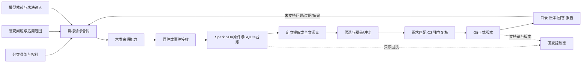

# 六项重新审查与整改 · 2026-10-10

基线：main f87f780ddb277386b7bb171f5c1c7229a0caa32c。源码、运行 SQLite/发布快照、两个供应仓库和 GitHub 工作流分别取证。以下数值有不同分母与时点，不能拼成一个“完成率”。本次没有依据上轮结论推断现状。

## 一、架构与指令

**保留模块化单体，整改业务状态与权威；现在没有重写框架或拆微服务的收益证据。** 核心标准库 Python，SQLite 管运行事务，Git 管正式研究版本；HTTP/CLI 共用用例。knowledge、materials、workflow、storage、adapters、interfaces、delivery 的责任可以解释，主要风险是跨层消费者对“完成”的理解不一致。

当前规则覆盖 17 个正式主题，规范有唯一入口和替代链。但 CURRENT 已长到 257 行，夹杂大量历史发布步骤，README 仍声称 Spark 不可用，实际 Spark 在处理资料。已把 CURRENT 收为规则路由与更新边界，历史发布快照退出执行入口；修正 README，保持唯一规范源。

研究交付应分为：目录查询、带条件的证据/陈述、具体问题的回答、带假设的情景模型。458 个问题、305 条正式陈述、0 条正式答案记录说明答案闭环尚未形成，不能由资料量或图册完成度代替。既有陈述和专题仍有用途，这个判断限定于正式 answers/支持链的闭题机制。

## 二、骨架与目录结构

**五系统、IT 三分、存储再分、61 物理部件 + 1 软件 + 1 基型成立；稳定身份无需推倒。** 17 条链路和六项站点权利有清楚用途，分类树解释类别组成；实际产品、配置与项目实例必须分别识别。图谱 373 条关系只有 part_of 96、supplies 275、holds 2，尚非可计算的电力、冷却或接口拓扑；图册 35/35 是视觉发布完成，不能宣称工程图谱完成。

已修正节点页、报告与生成器的 IT 四分残留，bom 顶部退出旧分类的现行说明。部件档案新增只读目标摘要，使图与任务书连起来。建设阶段与最长交期不冒充项目关键路径；成本的父项含价/子件计价、共享和冗余仍须明确，不能按分类层级直接求和。

源码目录已有领域/层次划分，继续沿用，目录职责表纳入 09 唯一规范。含糊模块实际改名：delivery/map.py → project_capacity_map.py；workflow/progress.py → triage_progress.py；knowledge/policy.py → data_rules.py。导入、命令注册、测试、注册表同时更新，不留转发壳。原件、研究证据和数据库不进入改名/清理范围。

## 三、爆炸图与需求合同

351 个目标可覆盖部件/权利和非用户模型输入，但覆盖不等于问题已表达完整：185 行无模型输入链接，214 行没有同节点/变量类的精确问题链接。前者有不少是目录需求，后者包含跨节点的因子研究；不能自动判无效，也不能自动声称全部语义对齐。

已增加 request.version=1：节点、问题检索关联、scope_required，以及五类请求轮廓的字段、验收和不能证明什么。任务实际范围仍必须写型号/配置、地域、时间、条件和缺失项；同节点/变量类只是检索关系。服务端阻止无目标采集需求、无关问题、错误队/主机；旧无目标记录保留可读，不能再派工。重放、并发版本和角色边界继续验收。

运行目标原先把额定功率、PUE 贡献、利用率一起交给 Fetchspec，超出厂商规格能力。已限定为原厂额定/测试值、效率曲线和可靠性条件；实际运行实耗、PUE、利用率需要运营证据。61 个运行目标只有 20 个来源登记，其余通用模板明确保留，不猜造出处。

## 四、数据库、门槛与服务

### 当前规模（明确载体）

| 载体 | 实测规模 / 记录 | 时点与含义 |
|---|---|---|
| Git facts.json | 7,849 条，13.04 MB | 基线源码的数字事实，非全是本轮 C3 采用 |
| Git 正式研究 | 文档 46、证据 331、陈述 305、答案 0；JSON 3.09 MB | 源码版本化登记；支持链与记录数另验 |
| Git 其他研究 | 项目 126、价格 512、事件卡 42、产品条目 175 | 各自是不同业务集合 |
| Spark Reader | 44,759 份内容身份；登记字节合计 107,666,748,511 | 2026-10-10 14:25:50 UTC 发布测量；不等于目录 du |
| Spark 阅读当前状态 | complete 1,302、queued 19,233、blocked 24,211、failed 11、running 2 | 同次 current_readings，完整报告不是正式采用；不同于所有历史 reading_runs |
| Spark 三运行库 | Reader 主文件约 247.8 MB、Acquisition 231.4 MB、Review 17.5 MB | 同次数据库主文件，WAL/SHM 单列，索引在库内 |
| Spark 整体目录 | 458.14 GB | 14:25 发布快照所载的 13:44 目录采样；含原件、incoming、副本、OCR 等，不是唯一原件量 |
| AWS | 候选快照 142.34 MB、产品库 138.28 MB、运行目录 293.33 MB | 14:26:49 UTC；父子包含关系，不能相加 |

原件保存为内容 SHA 寻址文件，SQLite 保存身份、来源观察、任务/版本/指针，阅读/提取与审计产物用 JSON/JSONL/文本；AWS 消费白名单候选 JSON 和公司产品 SQLite；正式研究 JSON/CSV/Markdown 随 Git 版本发布。相同字节可有多个来源观察，多个问题引用同一原件，不复制原文来充数量。

进门分四层：来源与传输完整性 → 提取/口径和覆盖 → 研究适用性/C3/独立复核 → 精确版本发布与权限过滤。SHA、路径、来源/分发权限、原文定位不放宽；目录参数、事件线索和正式答案采用不同产品验收，不能要求每条新闻都完整深读，也不能用高分代替采用。

出门须有发布版本和允许分发范围；正式记录不能由收料回执自动改写。已纠正 8 条目标的混合模型证据误标：37 sourced/4 assumed → 29 sourced/12 assumed，271 needed/39 delivered 保持；这是状态纠错，没有新增证据。尺度和数量等自登记属性也不再标 sourced。

已实际做有界恢复演练：Spark 三库分别 SQLite online 一致备份，复制到独立 m5；逐库 SHA、integrity_check 和全部表行数核对通过；五份原件样本跨机 SHA 通过。各库独立一致，不是跨库事务快照；这不证明整个约 458 GB 档案的异地备份、全服务恢复、RPO/RTO 已完成。私有副本保留，不覆盖生产。

## 五、inews.today 与 Fetchspec

inews 的当前能力是新闻发现、聚类、标签和原始出处指针；研究端验证固定 HTTPS 来源、完整分页、窗口与对象身份，再保存来源观察。Fetchspec 交带清单/SHA/来源/目标的原厂资料包，研究端核包、保原件、索引和版本，再交提取/Reader。二者在各自能力范围可用，但不能据此认定所有 351 个需求都能交付。

运行实测：inews 当前窗口有 23 个目标的线索；Fetchspec 累计回执有 39 个目标、45 份产品资料。前者不能当累计历史，后者也不代表所有型号或配置；inews 的 Git 新闻目标仍 needed，状态板将“运行已见/Git 仍缺”作为对账提示，不自动采用。

四支未接通能力共 171 行：fetchfilings 62、fetchreports 62、fetchstat 26、fetchquotes 21。不能简单把 171 行全塞进一个 repo 就说解决。建议承载可共用 fetchdata，适配器和验收按统计/披露/报告/报价分开：先选具名关键输入跑通“目标 → 原件 → 有条件观察 → 审核 → 模型替换/回答”的纵向样例，再扩大覆盖。未接通的责任行无到期日，页面明确缺口，不建立空入口。

保留拒绝坏包、非法路径、哈希/来源/权限错误、目标错误；合格原件但解析失败保留并标补提取。背景、重复、需专家、未匹配需求是研究去向，不是丢弃原件。事件卡规范与实现已统一：有效目标解析对象范围，新 import 显式保存 object_ids，冲突绑定拒绝；这个归属不证明正文语义或 C3。阅读状态改读 current_readings，避免初始失败遮蔽已激活版本；读库失败与尚未登记分开。

本次只改研究端共享目标与契约投影，不修改两个供应 repo 的私有库和编辑流程。新请求轮廓不冒充原有 package/feed schema 已升级；消费者兼容与真实交付分别核验。

## 六、代码、CI 与节奏

基线核心源码 154 个 Python 文件、29,839 行，review/registry/publish/reader/http 是主要大模块。已经按现行用例、事务和消费者检查，未采用“没有静态 import 就删除”的危险判据：CLI 注册、HTTP 路由、动态适配器与机器服务也会使用代码。确认未引用的私有 _slug 已删除；两处裸 open().read() 改为明确关闭的 Path.read_bytes()；失效说明修正；命名清理详见第二项。删除了目标行未绑定的旧事件卡扩大认领分支（当前 42 张 Git 卡全部绑定目标）；此类卡不再认证任何当前目标，CI 校验明确拒绝。稳定兼容路由和历史研究载体有现行消费者，不能把它们的年龄当作无用证明。

最近 25 个工作流 23 成功/2 取消，14 PR/11 main push；成功运行从创建到更新的墙钟 106–938 秒、平均 411 秒，包含排队与调度，不能当纯测试耗时。既有保守影响分流方向正确：研究追加跑研究链路，代码/规则/未知仍全套。本轮不削弱检查，不改 300 秒单例/15 分钟作业门槛。规范补充实质变更集中一批、本地验收后再推、共同失败先修根因，避免连续推送重复取消。

后续大模块应按稳定用例与事务边界渐进拆分，而非一口气移动所有文件。目录规则、引用核对与测试必须随任何改名同步；删除占位和确认无用代码，不留双实现过渡层。每阶段以有效阅读、关键输入/问题闭环、正式采用上线、未发 PR 数与最老等待计量，PR 个数只是队列数据。

## 整改后的结构

## 仍需真正完成的研究工作

- 17 个模型未验证输入（16 假设、1 缺失）及 214 条待审问题映射，不能靠改状态消失。
- 四类未接通来源能力：先做具名输入的最小真实交付，再决定仓库承载和规模化；优先级由模型影响与来源可得性共同判断。
- 运行类人工来源、站点权利来源日历、带来源的功能拓扑样例；保留明确边界直到有证据。
- 全档案异地备份、全服务恢复演练和 RPO/RTO；本轮只完成三库及小样本跨机恢复。

M1–M4 的源码、规范、生成物和实际测试同批交付；M5 以受保护合并、精确生产版本和网站回执结束，私有发布回执与源码测试分别保存。执行计划见 PLAN.md。
