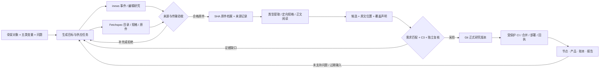
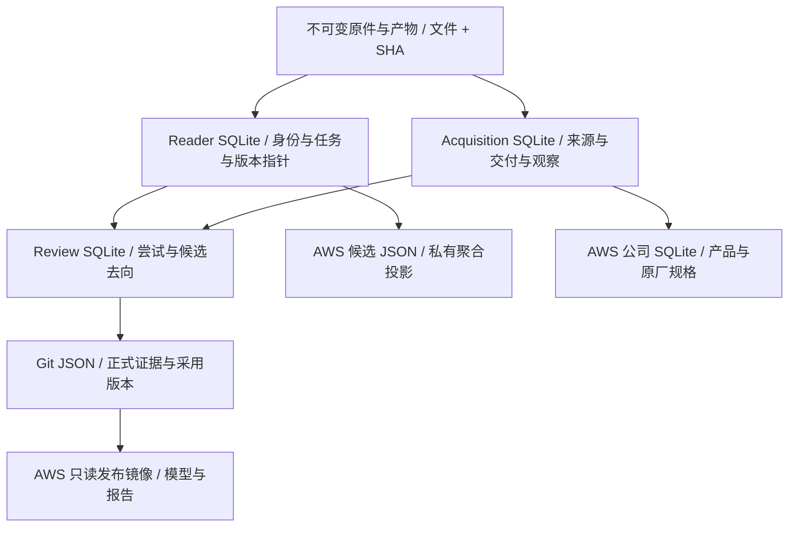

# 项目审查 · 2026-10-10

审查基线：`265237e7378500f2a7226aec61230c89dd5cb2a6`，m5 独立工作树。生产观察约北京时间 21:29–21:43；Spark 与 AWS 分别采样，数值不是跨机器一致事务。源码证据见同目录 source-scan.json，运行聚合见 spark-measurements.json、website-measurements.json、news-coverage.json、product-coverage.json。本文是本次审查记录，不替代 framework/CURRENT.md 登记的现行规范。

## 1. 架构、指令与业务流程

**判断：核心架构适合当前规模，主要问题是状态权威与操作认知的复杂度，不需要立即换框架或拆微服务。**

现行组织是 materials / knowledge / workflow / delivery / adapters / interfaces / storage。Python 标准库与 SQLite 降低部署依赖；HTTP 与 CLI 共用业务用例；原件、运行状态、正式研究分别持久保存。正式版本经 Git/受保护 PR 发布，原件和候选不塞进 Git。这些边界合理。

业务实际有三种交付：新闻线索、产品目录/定向规格、全文研究。新闻不必全文翻译，规格不必逐份全文研究；能支持研究结论的内容仍须原文、条件与 C3 审核。若把三者排成同一个“全部材料逐篇深读”漏斗，会制造无效排队。

指令的当前入口清楚，但 CURRENT 中混入大量逐次图册发布细节；供料 provider.mapping 仍用旧 P/F/V/D、T01–T09，程序职责 README 还指导已退役的 SEC/GPU 子命令。前两者分别是入口噪声和现行描述冲突。此次更正供料映射与失效命令说明；不删除历史验收。

流程最显著的实际故障：editorial_sync.enroll 把范围上限写成 5,000，Reader 允许 10,000；生产为 7,739，导致 editorial service 因 invalid_existing_scope 失败。此次复用统一 read_scope 校验，保留 1 MiB/10,000 上限、完整 SHA 和稳定锁，容量已满时重复投递仍幂等，新增明确拒绝。未改变阅读配方、队列优先级、原件或研究采用权限。

建议后续把 CURRENT 的长篇逐项回执移到已有发布/交接记录，入口只留现行摘要和链接；这是文档整理，不应重写历史事实。七个包含延迟 import 的依赖环是模块责任继续分解的线索，不等同于加载故障；本次未进行未经验收的大面积搬移。

## 2. 骨架是否合理

**判断：五系统 + IT 子树 + 独立站点权利，适合作为研究导航；不是完整的工程系统模型。**

BOM 有 63 条：61 物理部件、1 软件、1 基型。按自己的价格、供应商与交期停止细分，比按厂商型号无限扩树合理。IT 的计算/存储/网络，以及内存/持久存储区分也合理。稳定 ID、别名、kind、stage 与尺度属性保留，有利于来源与问题长期引用。

但树只能表达单一包含归属，不能独自表达供电、冷却、数据通路、替代配置与共享容量。应继续用关系/模型表达这些联系，不能在两个子树复制同一物理件并累计两次，也不能把站点权利或软件建成虚构物理件。数据中心行业总览与单座项目模型应保持不同统计分母。

需要重新思考的是**通用研究对象与某个现场实例**的界限：当前图册明确为通用示例，型号、数量、额定容量与 OEM 完整拓扑不能由美观图自动取得。业务要做真实项目 BOM、资产盘点或容量承诺时，必须另有项目实例/配置与来源证据；不能只给通用图加更多细节就宣称完成。

此次 dashboard 明示“图解释结构，目标表达需求”，把物理包含、功能连接、建设顺序和证据支持分开，链接保留至实际 BOM、节点与账本页面。

## 3. 爆炸图与需求拆分是否清楚

**判断：图的解释能力已足够丰富，真正短板是需求覆盖和供料回执的闭环。**

源数据有 458 个问题、351 条生成目标，状态为 needed 271、delivered 39、sourced 37、assumed 4。needed 约 77.2%；此比例是目标状态，不是项目进度、文件阅读率或事实正确率。

| 供应能力 | 目标 | 缺 | 已交付 | 有数据登记 | 假设 |
|---|---:|---:|---:|---:|---:|
| Fetchspec | 130 | 85 | 39 | 6 | 0 |
| inews | 50 | 50 | 0 | 0 | 0 |
| fetchreports | 62 | 52 | 0 | 10 | 0 |
| fetchfilings | 62 | 52 | 0 | 8 | 2 |
| fetchstat | 26 | 15 | 0 | 10 | 1 |
| fetchquotes | 21 | 17 | 0 | 3 | 1 |

目标行已有对象、变量类、来源机制、执行机与日历，可以给供料端明确任务。此前生成原则却说所有交付按 Fetchspec 包格式，与实际 inews HTTP feed 冲突；此次更正为按供应协议接收、供应中心汇总、正式采用另验。

新闻端本次已有 16,137 条运行登记，其中 93 条带 origin_pointer、2,797 条带 object_ids、723 条带 target_ids，同时有原件指针与对象标签的只有 32 条。这是字段存在性统计，未逐条证明链接内容、目标匹配、授权或正式采用。Git 目标表 50 行仍全缺，说明运行同步与 Git 交付载体之间没有自然等价关系。应按现有 deliveries import 对满足条件的真实回执进行作者审核后登记，而不是把所有新闻强行刷成 delivered。

运行接收与正式发布的分离有审计价值，但**每条交付都等一次人工 Git 搬运**会使目标表低估真实运行供给。下一阶段可增加明确标注的“运行已收、Git未登记”只读对账视图，复用现有 ledger/receiver 身份；不自动改变 sourced 或 C3。此次控制室先清楚展示这一区别，未伪造生产任务或新闻回执。

## 4. 数据库设计、规模、门槛与服务

**判断：不是一个大数据库，而是三个研究运行库、公司产品库、文件原件库与 Git 发布研究版本。当前规模无需因容量改成分布式数据库。**

| 存储 | 本次实测 | 内容与服务 |
|---|---:|---|
| Spark 文件目录 | 458.12 GB 分配占用 | raw-materials、originals、incoming、提取/OCR/图像/报告与备份等 |
| Reader 内容登记 | 44,758 身份；SUM(size_bytes) 107.67 GB | 含 PDF、HTML、文本派生、CAD、音视频等；不是纯报告原件总量 |
| Reader SQLite 主文件 | 247.69 MB | 文档、来源、任务、阅读版本与当前报告 |
| Acquisition SQLite 主文件 | 231.31 MB | 来源、新闻、交付、观察和产品资料索引 |
| Review SQLite 主文件 | 17.36 MB | 批次、候选去向、尝试、调度与发布状态 |
| AWS 公司产品 SQLite 合计 | 138.28 MB；18 公司、7,260 产品行 | 公司产品目录、原厂参数、快照版本与来源；产品行不等于确认在售具体型号 |
| AWS 候选 JSON | 140.77 MB | Spark 接收投影，不复制全库原件 |
| AWS data 目录 | 291.38 MB 分配占用 | 包含产品库、候选快照及其他运行文件 |

GB/MB 采用十进制；WAL/SHM 另见 JSON 实测，库内 index 已包含于主库。目录扫描时点较数据库采样早，存在硬链接和不同计量范围；不能相减宣称去重节省。备份目录 19.21 MB 也不证明全部原件已经异机备份或可恢复。

Reader 当前状态：complete 1,276、running 2、failed 11、queued 19,258、blocked 24,211。登记含派生件与不支持格式，不能把所有 queued/blocked 当成待读全文报告，更不能据此宣布 2.9% 全文完成率。

原件按 SHA 文件身份保留，SQLite 引用原件和封印产物。正式研究使用 JSON 中的 documents/evidence/statements/answers；本源码快照分别为 44/326/301/0。同期 AWS 支持链成立的陈述 301，项目 126、合同 8；分别是快照计量，不能宣称 458 个研究问题已有完整正式答案。目录、产品、价格、项目、合同、模型与报告可提供检索、对比、引用追踪与假设分析，不能直接证明预测已验证或现场资产已测量。

入库四门：①来源/字节/清单/路径/范围；②可解析与覆盖；③原文/条件/C3/独立复核；④精确版本/CI/部署/网站回执。硬身份与原文条件应保持；评分只调优先级。定向规格和全文研究分别验收，避免一刀切深读。

出库须遵守具体事实分发范围，内部资料不能靠金额转区间变成可公开。正式采用应验证支持闭包，未审核候选、链接和运行计数不可伪装成答案。历史 facts 表有 7,849 条、312 指标，本次只读契约审计发现 37 条缺少有效原件 SHA；另有 71 条 P1、36 条 P2 的时效/来源任务。缺口必须回查原件或明确暂不采用，不能用伪 SHA 修成绿色。此次没有覆盖或删除旧事实。

存储可靠性仍有未覆盖项：并行写入不同数据库不构成分布式事务；多文件变更依赖各自预备日志/主提交点；SQLite online backup、原件异机备份和实际恢复演练不能只凭文件存在认定。生产数据迁移与大规模重构应以这些验证为前置，而非为了统一格式先搬库。

## 5. inews / Fetchspec 是否满足期待

**判断：二者满足各自已实现部分，不能满足整个项目所有数据期待。**

inews 提供事件发现、增量 feed 与独立的 authored_analysis 专栏交付。采集线默认不翻译，编辑精选后翻译合理。研究端检验 schema、分页窗口、时间、URL、对象/目标身份；未知对象标签逐项过滤，不因标签制造采用。专栏保留作者身份与引用目录，引用链接不自动变成独立一手证据。此次修复其实际接收阻塞。

Fetchspec 提供官网目录、规格表、原文件、不可变快照与版本信息。包接收校验 manifest/SHA256SUMS/实际文件集合、路径/大小/SHA、目标归属；原厂发布方与产品制造商分开。AWS 结构化产品库按公司保存 products/sources/source_observations/versions/specs/materials/runs；payload 保留原厂字段与条件，specs 记录原生表格行。原厂不同产品的字段不强套单模板。传输验证与可解析状态不授予正式研究采用。

原件归 Spark acquisition/blobs 与 originals；尽量硬链接复用，旧包与旧版本保留。只有显式选定且可解析的 SHA 才投 Reader，不把 CAD/视频等无限扩入全文队列。不支持解析可以永久归档并需补充；拒绝坏包不等于删除来源原件或判产品不存在。

需要改善的是交付质量的度量：产品数与新闻数之外，应关心目标匹配率、来源可追溯率、参数条件保留率、接收到可用的延迟、补交关闭时间。上述指标要有逐项分母和时点，不能拿新闻数对比产品数。四个未接能力宜先按优先经济模型输入补现有来源机制；不应为了“六队”口号马上新增四个空 repo。

## 6. 全站代码、冲突、PR 与验收要求

源码扫描覆盖 154 个 Python 模块、105 个页面/组件/主题文件。AST 未发现失效内部 import 或完全重复的非空 Python 模块；七个包含延迟 import 的依赖环和 41 个未被其他 core 模块直接引用的入口已列入 source-scan.json。许多入口由 CLI 字符串注册、测试或部署调用，所以这不是 41 个死模块。不能以搜索零命中删除。大模块集中于 research_review、registry、research_publish、reader、http 与 product_catalog；后续按业务事务和责任拆分，比按文件行数机械拆分可靠。

此次实际整改：

1. Reader / editorial 范围合同归一，修复生产 7,739 条范围被 5,000 上限误拒绝；覆盖大范围、满容量重放、新增拒绝和坏结构。
2. 供料 mapping 去除退役分类；目标原则承认 Fetchspec 包与 inews feed 的不同协议；README 移除失效采集命令。
3. facts CLI 使用标准参数解析；--help 与未知参数不读取/输出全库，新增 --summary 只读审计且保留失败退出码。本次亲自遇到旧 --help 倾倒整库，是不必要的输出与 token 成本。
4. 重设计 inresearchrepo 控制室：六项审查、来源生成的需求覆盖、研究架构关系、四门验收与数据服务；运行容量继续使用原白名单 API。次要模块说明与旧 CI 快照收起，320/390/1440 明暗模式、登录/权限/未知/失败重试仍验收。
5. 保持原件、旧事实与旧失败审计，未用大规模删除或数据搬迁冒充清理。

CI 今天已实施完整 Git 差异分流。仅追加有界研究保留研究相关检查，代码/旧数据/规则仍全套；17 个浏览器分片和存储按计划汇总，validate/browser (core) 两门稳定。这个方向合理，不应再恢复每条资料跑所有 3D，也不能为了快而跳过必要检查。

21:38 左右核查两个研究 PR（616/617），作业 steps=[]，GitHub annotation 明确 Actions budget 阻止启动；不是源码测试失败。用户随后恢复预算，本次已重跑未启动的失败检查。成本改进应区分等待 runner、预算阻塞、依赖安装、实际测试与重复验收，不能把所有等待归因于代码要求过高。

现有研究队列保持单一所有者。研究 PR 先完成当前队列，实质代码/规则修复合成一个可审阅 PR；不为每个状态回执再开孤立 PR。完整最终 head 测试、受保护合并、真实部署与网站字节回执仍不可省略。

## 本次之后优先重新思考

| 优先级 | 问题 | 完成标准 |
|---|---|---|
| P0 | 实际接收服务边界冲突 | 修复上线后 editorial 正常接收，旧身份和范围保留 |
| P0 | 旧 facts 原件身份缺口 | 每条回查确切原件并核 SHA，或保持未核验状态；不伪造补齐 |
| P1 | 研究问题闭环优先级 | 先点名影响账本最大的不确定输入及一组问题，明确所需证据与负责人 |
| P1 | 运行交付 / Git登记对账 | 显示同一目标真实 runtime 已收与 Git 状态，差异逐项可解释 |
| P1 | 供应结构缺口 | 价格、财报、统计和实证按现有能力给出有来源的交付，而非空建 repo |
| P1 | 原件备份恢复 | 从独立副本实际恢复一组原件、SQLite 一致快照及引用链，不损生产 |
| P2 | 模块与入口收敛 | 沿真实调用/事务边界拆大模块；保留行为与历史兼容测试 |
| P2 | 规范入口降噪 | CURRENT 留现行摘要，逐项历史回执归现有记录，不改变采用事实 |

这些不是本次已经完成的事实。尤其 37 条原件缺口、107 条时效/来源任务、四类未接能力、备份恢复演练与正式答案闭环仍需继续执行。新增来源获取与事实采用应各自走现行验收，不能作为代码审查的副产品自动取得采用权。

## 项目关系图

最终测试与实际发布回执在 docs/handoff/project-audit-20261010.md 中登记；本文件的源码扫描和历史采样不冒充最终部署证据。
