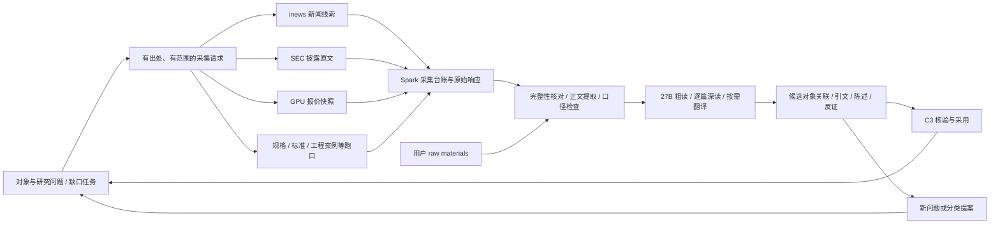

# 06 · 采集、翻译与研究材料闭环

> CURRENT · 2026-09-06 · 用户要求全局梳理 inews 新闻、SEC、GPU 租价和 Spark 27B；以今天的研究架构为准，逐步实施。全站 Attio / folk 已确定，2D / 3D 后续沿用。

## 一个研究底座，两种进入方式

研究问题主动寻找材料，用户投递材料反向发现问题，两者共享对象、问题、来源和候选证据身份。

采集请求至少记录 `question_id`、对象范围、要找什么、来源、时间与地域、证据要求、优先级和完成条件。请求 ID 与来源文档 ID 分开；一份材料可服务多个问题，多个来源可证明或反驳同一问题。归档一次、关系多挂，不为每个物理层级复制一份原文。

已有 `research_questions.json` 与缺口任务是需求源，不再手写另一份竞争性任务树。第一阶段 CLI 的 `--question` 会验证现行问题 ID 并登记 `top_down` 关联；未指定问题的线索保留为 bottom-up 待映射材料。实体词命中只是候选，不构成回答或采用。

## 产品与机器边界

| 层 | 责任与正式状态归属 |
|---|---|
| inews.today | 继续做新闻发现、聚类、筛选、标题翻译和新闻产品。新闻数据库、编辑记录与账号由 inews 自己管理 |
| inresearch.ai | 研究对象、问题、采集请求、证据、口径、深读结果、采用与交付 |
| AWS | 新闻产品和研究网页；研究网页显示 Spark 的派生状态，不把网页按钮直接变成模型长任务 |
| Spark | inresearch 新采集原件、报价快照、永久采集台账、reader 台账、27B 阅读与翻译产物 |
| macmini | 必须使用已授权浏览器登录态的采集；原件交给所属研究产品，登录态留在原机器 |
| m4 / m5 | 人的操作、上传、开发、校验和交付 |

参考 infra 的 `docs/infrastructure-review-2026-09-05.md`、`docs/production-topology.md` 与 `dgx-spark/BOUNDARIES.md`。infra 的临时文件队列默认 14 天清理，不作为研究永久档案。其旧“Spark 无 Python 常驻服务”描述早于今天已采用的 inresearch reader，研究服务以本项目 Spark 操作手册和实机状态为准；不把 OA 的业务队列或账号并入研究系统。

inews 的数据库当前包含身份和内容，研究端只接显式字段投影，不复制整库，不借新闻账号绕过研究权限。第一阶段通过授权运维通道只读导出文章字段；后续改成可增量同步的正式机器接口，保留删除/撤回、聚类变更和翻译修订记录。

## 三类来源如何使用

### 新闻：线索、事件变化与回到原始出处

已审阅 `inews.today/src/lib/db.js`、`translate.js`、聚类逻辑和服务路由。现有数据包括原题、中文题、翻译配方、发布时间、首次发现时间、来源、聚类 ID 等。新闻主表并不代表已取得每篇全文。

1. 有界导出近期、相关、未下架文章的指定字段；保留 inews GUID / ID 和聚类身份。
2. 研究端用公司/项目词与行业语境生成候选线索。保留未命中已知实体但涉及行业的新闻，避免只研究已认识的公司。
3. 线索关联问题后寻找发行人公告、监管原文、技术白皮书等原始出处；取得合法可访问正文才交给逐篇深读。
4. 标题翻译沿用 inews 结果及配方；不把标题、摘要或媒体转述冒充文章全文或原始证据。
5. 同一事件多媒体报道按来源保留，使用聚类关系减少重复研究；不按相似标题删除唯一原文。

第一阶段是有界投影，不是完整历史镜像或可靠增量游标。`truncated=true` 明示窗口被截断。正文补抓、撤回传播、历史回填、推送/游标是下一阶段。

### SEC：清单、原文、结构化事实分开

使用 SEC Submissions JSON 发现披露，再按 CIK / accession / primaryDocument 获取正文。10-K、10-Q、8-K、20-F、6-K 及修订件各保留身份；修订文件不能覆盖历史原件。第一阶段默认只抓一家公司的 1 份主文件，支持最多 10 份；附件及更久历史清单尚未自动回填。

原始 HTML / JSON 按内容哈希永久保存，提取文本与译文为派生产物。XBRL / companyfacts 下一阶段单独处理：必须保留 concept、unit、period start/end、instant/duration、form、accession、filed、frame 等；不能把不同会计期间或重报混为一条最新数字。

SEC 官方要求声明自动访问身份并控制请求频率，当前开发规则上限为总计 10 次/秒。第一阶段串行，文件请求间隔至少 0.6 秒，遇到 403/429 等记录失败，不冒充采集成功或绕过限制。参见 [SEC Developer Resources](https://www.sec.gov/about/developer-resources)、[EDGAR API](https://www.sec.gov/search-filings/edgar-application-programming-interfaces)。后续定时器必须共享来源限速、退避和预算。

### GPU：结构化观察，不需要模型猜价格

现行接口使用 Vast 官方 Search Offers 的 POST 查询；需要部署 `VAST_API_KEY` 时明确显示缺凭据，不假装返回了空市场。[官方 API](https://docs.vast.ai/api-reference/search/search-offers) 与 [计价说明](https://docs.vast.ai/guides/instances/pricing)区分按需、可中断和其他成本。

第一阶段查询固定 GPU、1 卡、可租且未租、on-demand、按列示小时总价排序的最多 20 个报价。保存完整响应、查询条件、采集 UTC 时间、GPU 数量、价格字段、地区、可靠性、存储和网络费等原字段。统计时排除重复、错误型号/卡数、可中断记录及非有限/非正价格。

中位数只是这一查询得到的低价样本，不代表全市场成交价。单位为 `USD/offer-hour`；1 卡约束不能证明报价没有附带 CPU、内存、存储等成本。不将 on-demand 命名成 bid/interruptible，也不与专属云、长约、托管或其他地区报价混比。

旧脚本曾直接写入 `prices.json` 的 `*-spot` 系列已停止续写；历史点保留，不能靠新采集器自动证明或改写旧点。新观察保持 candidate，正式指标换源/改名须另行核验、建立版本链。27B 负责解释条款和异常，数值抽取、单位换算和统计由确定性程序负责。

## 存储与阅读入口

| Spark 路径（相对 `~/.local/share/inresearch.ai/`） | 内容 |
|---|---|
| `acquisition/catalog.sqlite` | 来源项、原始响应版本、采集运行与错误、问题关联；永久保存 |
| `acquisition/blobs/<前2位>/<sha>.<格式>` | 原始响应内容；同字节去重，不覆盖历史 |
| `raw-materials/` | 用户投料及以后完成预处理的阅读投递入口；隐藏上传批次不提前扫描 |
| `catalog/catalog.sqlite` | 已有 reader 的逐篇阅读与归档台账；不复制到采集台账 |
| `originals/`、`extracted/`、`artifacts/` | 已有 reader 的原件、提取和候选成果 |
| `library/` | 分类视图，不改变原件内容身份 |

第一阶段采集结果**不会自动投入 raw-materials**。原因是新闻多为标题、SEC 原件可能是 HTML，而现有 reader 原生支持 PDF / UTF-8 文本等，不能把格式不支持或仅有清单的文件算作已深读。下一阶段加入正文完整性门槛、保留表格结构的提取、可追溯派生文件和 handoff 状态，再汇入同一个 reader。用户正在上传的批次独立校验、独立开放。

## 27B 的翻译与研究合同

沿用 infra 登记及实机配置的 `qwen3.8:27b`；此名称是本机 tag，不推断上游官方型号。模型产物必须记录实际 tag / digest、提示词版本、分块规则、源文件哈希、段落定位、目标语言、时间和失败状态。

- 原文永久保留；译文逐段对齐原文，分析另存。标题译文、全文译文、摘要、研究结论是四种不同产物。
- SEC 优先翻译与研究问题相关的章节，并明确“节选”；需要完整全文时按段落分块、检查覆盖率，不能把节选包装成全文。
- 公司名、产品名、数字、币种、单位、日期、否定与条件要逐项对照；表格保留行列和脚注。数字比对失败进复核，不自动改成模型推测值。
- 模型只处理数据，材料内的指令不执行。模型失败进入可恢复队列，不切断网页、不写正式事实；不默认把研究原文发送付费外部模型。
- 新闻标题翻译、研究深读、OA 和其他使用者共享 Spark，但“各自并发 1”不等于全机并发 1。第二阶段落实全局并发/公平调度与预算后才扩量；第一阶段不另起翻译后台 worker 与现有 reader 抢占长任务。

**当前尚未上线全文翻译链路。** 已有 reader 的分析不等同于逐段译文。先验证英文原文 → 提取 → 小样本 27B 双语对齐 → 数值/覆盖校验，再增加批量任务。

## 分步实施与验收

| 阶段 | 范围与退出条件 |
|---|---|
| 1 · 本次基础实现 | 修复旧新闻目录契约、统一采集台账；新闻字段投影、SEC 清单及有界主文件抓取、GPU 原始响应与严格口径；失败明确；停止直接写正式价格；网页能查看 Spark 状态 |
| 2 · 正文与翻译小闭环 | 选新闻原始出处和 SEC 章节小样本；保留原文/提取/译文三份关系；数字与覆盖率校验；从采集台账可靠 handoff 到 reader |
| 3 · 持续运行 | 新闻增量接口与撤回传播、SEC 修订与附件、GPU 多来源可比面板；定时、退避、断点、模型公平调度；运行监控区分新鲜度与成功数 |
| 4 · 研究缺口驱动 | 对 415 个问题按证据类型与价值排优先级，补规格、标准、工程案例、区域电力/土地、供应商交付等；逐层补齐 P/F/V/D/R 与 3D 入口 |

每阶段以实测结果验收，不把计划写成服务已运行。没有全文、没有有效报价、缺凭据、被源站拒绝分别展示。采集完成、深读完成、译文校验、C3 采用分别计量。

CLI 与操作见 [Spark 采集手册](../docs/local_reader/ACQUISITION_OPERATIONS.md)。
