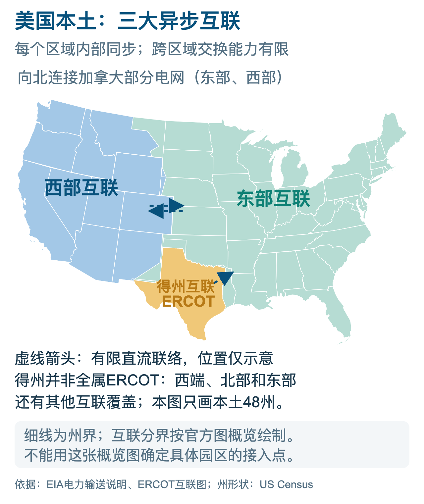
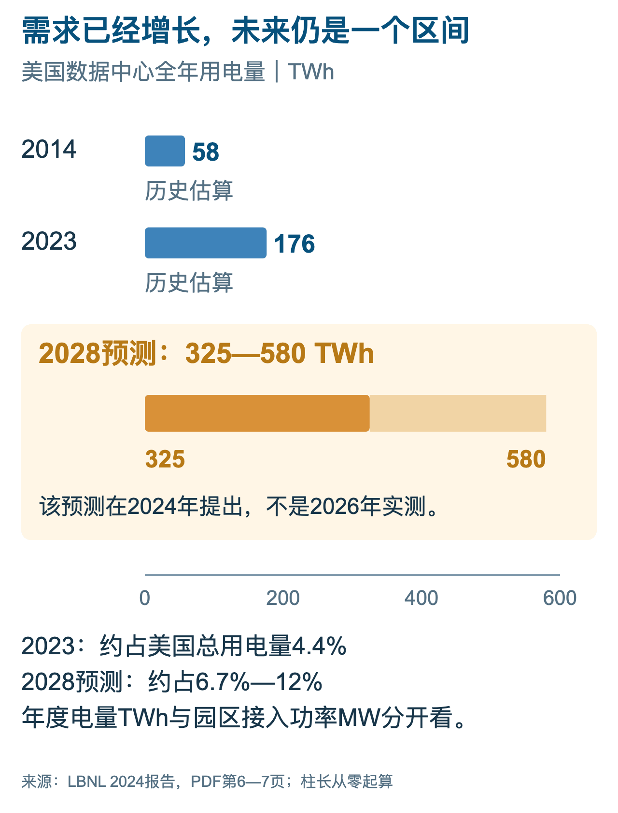
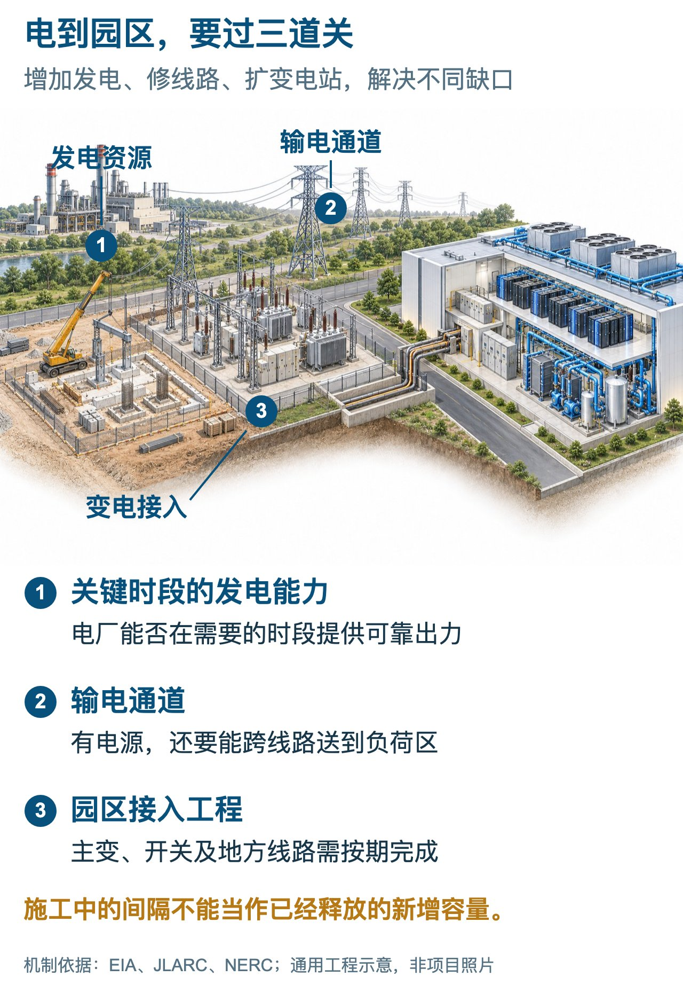
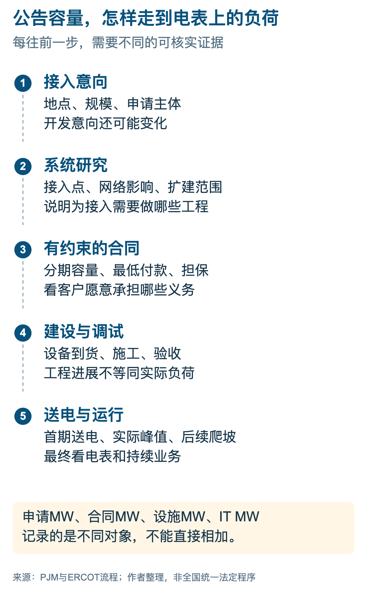
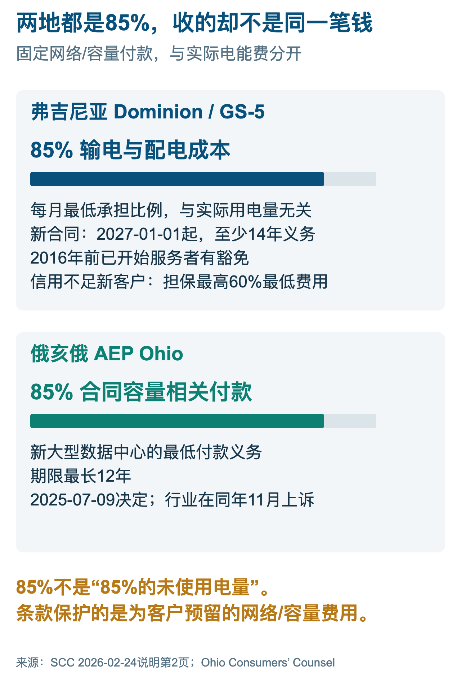
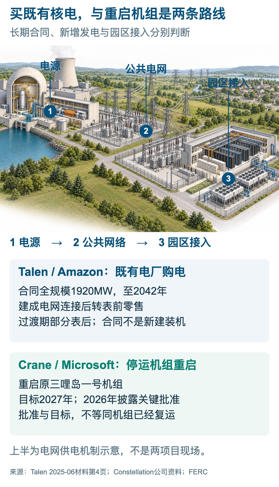
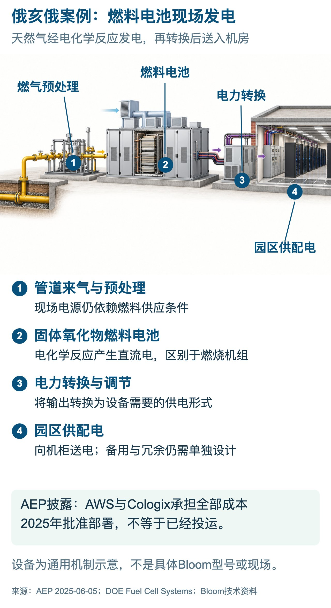
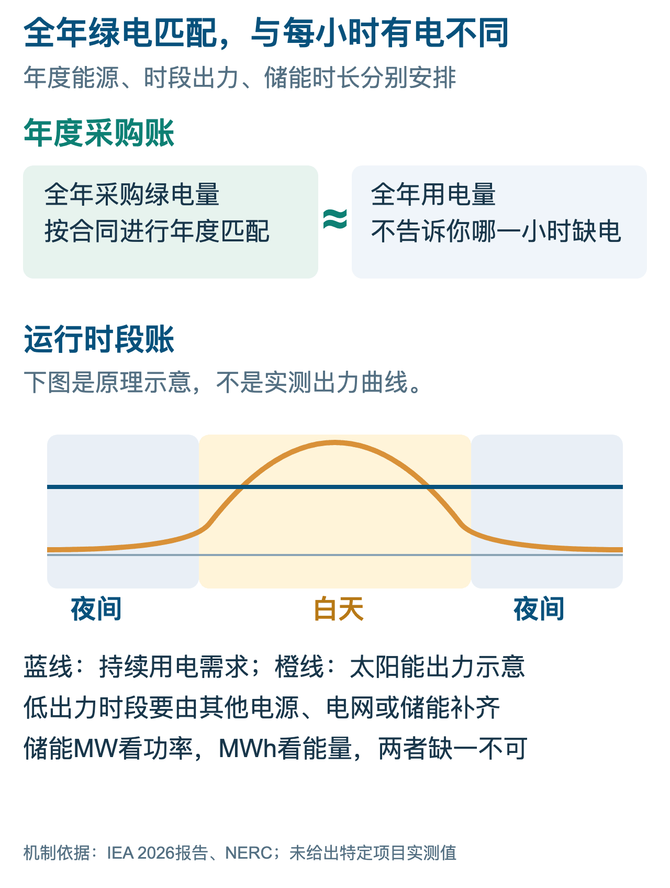
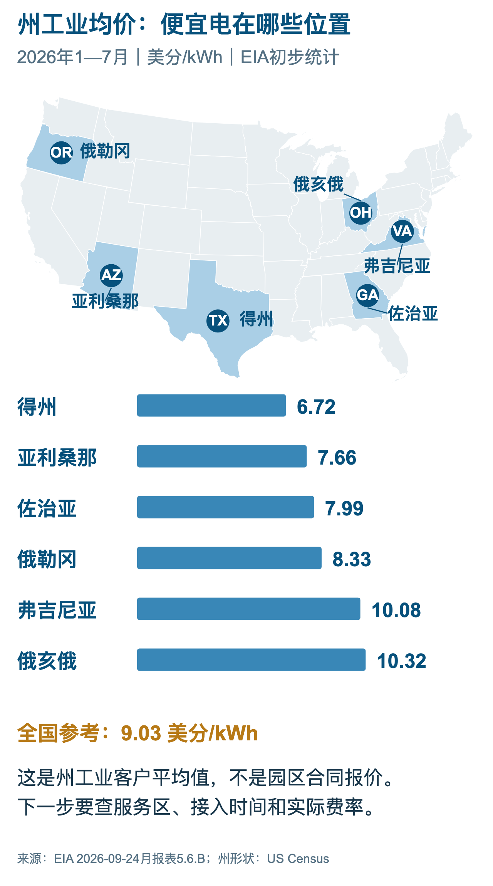
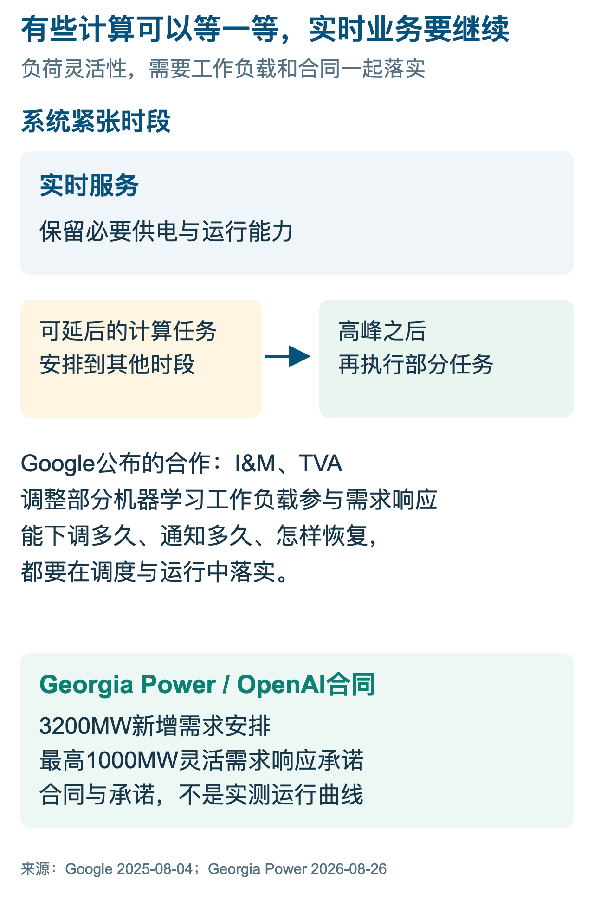

# 美国数据中心抢电，争的是通电时间

格洛可｜2026年10月9日

得州正在给大型用电项目重新排队。ERCOT在2026年6月公布首批集中研究安排，把符合条件、规模至少75MW的大负荷放进同一批次，预计到2027年秋才形成最终输电计划。此后还有设备采购、线路施工和接入。对急着扩建的算力公司，这张时间表比一句“当地能源丰富”具体得多。[6]

美国数据中心的电力难题，正在这里显出形状：园区要在约定时间拿到足够的电，电网要知道客户究竟会用多少，电力公司要有人为新增设施长期付款。通电时间把这三件事连在了一起，也开始改变下一座机房建在哪里。

## 第一章　美国的电，不能随意搬

美国本土连续的48个州，主要分属东部互联、西部互联和得州ERCOT互联。各系统内部的交流电网同步运行，系统之间靠有限联络交换电力。东、西系统还延伸到加拿大；ERCOT覆盖得州大部分地区，得州西端等部分地区属于其他互联。阿拉斯加和夏威夷另有系统。[1][6]

图1｜本土三大互联与有限联络。来源：EIA、ERCOT、美国人口普查局。

图上的三种颜色，首先划出了电力能够流动的范围。得州新建一批电厂，不会自动缓解弗吉尼亚某个园区的接电难题；东部系统有富余电源，也不能随意调进西部。跨系统送电需要专门的联络设施，交换能力受设备容量限制。即便同在一个系统内，电也要沿着实际线路走，沿途某一段满了，远处的电源就未必送得进来。

管电的人又是另一张地图。区域电网运营机构负责协调输电运行和电力交易，当地电力公司负责具体设施和客户服务，监管机构决定费率与投资如何回收。美国通常所说的七家RTO／ISO，是区域输电或系统运营机构，不是七家包办发电、输电、售电的垂直垄断企业。它们也没有覆盖美国所有地方。[2]

这套分工有很长的历史。1935年《联邦电力法》奠定了联邦监管跨州电力批发与输电的重要基础，州监管保留零售等职责；同年的《公用事业控股公司法》主要管控股公司结构，两者不能混写成一部法律。今天讨论“统一电网”，至少涉及物理连接、调度和市场、审批和收费三件事，单把电线连上并不能包办后两件。[2]

跨州新线路难建，也不只是各州愿不愿意合作。线路需要选址、取得土地权利、完成环境审查，还要说明沿线哪些客户受益、谁承担费用。电网运营机构能够算出需要扩容，却未必能替所有地方拿齐许可。联邦与州各有权限，项目必须把这些环节一一接起来。[2][3]

这样的电力系统，遇到的是一轮集中得多的需求增长。劳伦斯伯克利国家实验室2024年的全国研究估算，美国数据中心用电从2014年的58TWh增至2023年的176TWh，后者约占全国用电4.4%。同一研究预计，2028年可能达到325—580TWh，占比约6.7%—12%。这里的2028年是预测区间，已经发生的增长则有清楚的历史基数。[4]

图2｜全国用电增长的量级。来源：LBNL《2024 United States Data Center Energy Usage Report》。

TWh看起来离生活很远，换成度电就容易理解：1TWh等于10亿千瓦时，2023年的176TWh就是1760亿度电。但规划电网时，年度总量还不够。一个总负荷100MW、全年恒定运行的园区，按100MW×8760小时计算，一年用电8.76亿度；供电设施还必须在每个运行时刻承受这100MW负荷。实际园区的负荷会变化，这个算例用来区分“全年用了多少”和“此刻需要多大供电能力”。

数据中心也并非只有服务器吃电。芯片把电能变成计算，同时产生热量，冷却系统要把热带走；泵、风机和供配电损耗都计入园区账单。因此，服务器的IT功率和整个园区的总用电功率是两种口径。拿前者申请电力、拿后者安排设施，差额就会落到接入设计上。[4]

全国用电增长说明市场有多大，园区附近的线路、变电站和可用电源，才决定项目能多快落地。这是读美国数据中心电力新闻时最该先分清的两层。

## 第二章　电厂有电，机房为什么还要等

电从发电机出来，要经过高压输电线路，进入园区附近的变电站，再通过配电设施送到机房。变压器把电压降到后续设备能够使用的等级，机房内部还要把电分到各列机柜。数据中心接电，买到的是这条链路的服务，任何一段容量不足，都可能推迟通电。[3][7]

图3｜电源、输电和园区接入分别卡在哪里。来源：DOE、JLARC；通用工程示意。

第一处是电源。持续运行的算力需要在不同时间都能获得供电，系统必须有足够资源应对高峰、设备检修和故障。白天多了一批太阳能发电，能够补充电量；到了夜间，系统仍要安排其他电源或储能接替。规划者关心的因此既有全年发电量，也有吃紧时刻能够拿出来的供电能力。[13][14]

第二处是输电。电厂离园区可能很远，新增电力必须经过区域网络。线路的承载能力有限，电流增大还会影响沿途设备和系统运行。电网研究要检查正常运行，也要检查重要设备退出时电能怎样重新分配。这解释了一个看似奇怪的现象：附近一段线路还有余量，项目仍可能需要远处扩容，因为故障后的替代路径装不下新增负荷。[7][14]

第三处是接入设施。即使上游具备条件，当地还需要变电站、主变压器、开关设备及园区配电。电力设备有制造和采购周期，线路施工要取得通道，变电站要有合适土地。能源部已经把变压器供给紧张列为电网建设问题。机房大楼盖好了，并不代表这批设备也已到位。[3]

弗吉尼亚的压力集中在这条链路上。当地已经形成庞大的数据中心集群，客户、光纤和服务配套成熟，新项目仍想靠近现有市场。JLARC在2024年研究中指出，需求增长将要求大幅增加发电与输电设施。机房越集中，需要补强的地方也越集中；不能靠全国总装机增加来替代当地工程。[7]

得州则提供了另一种观察。大量大型负荷申请涌入后，ERCOT把符合条件的项目放进批次，共同研究它们对输电网络的影响。逐个项目单独看，可能每个都显得可以接；放在同一张网络里，才能看出它们会共同占用哪些线路、哪些地方必须扩建。批次研究能统一安排工程，也意味着项目必须接受共同的规划节奏。[6]

对开发商，供电承诺应该能够回答具体问题：哪座变电站送电，上游需不需要扩建，设备何时到货，哪一阶段可以接多少负荷。这些答案会改变施工顺序。先交付一部分机房，再随着电力扩容继续上架，通常比让整座园区在一个远期日期同时启动，更便于安排客户和资金。

对算力公司，等待会改变设备采购和客户交付的节奏。硬件不能因为电力延期就停止资金占用，长期合同也不会自动跟着施工顺延。因此，电价之外，通电日期、分期容量和可靠性开始进入同一份选址账单。电价便宜却晚到的园区，未必能提供便宜的算力。

## 第三章　接入申请，离真实需求有多远

接电难的另一面，是电网很难提前知道谁会真正用电。一个项目申请了几百兆瓦，首先表示开发商希望保留这种供电能力。要把它写进长期规划，还需要了解客户、建设条件和负荷增长安排。申请规模与最终形成的用电负荷之间，有一段需要用合同和工程来填上的距离。[5][6]

图4｜项目真实性怎样随合同与工程增加。来源：PJM、ERCOT、JLARC。

PJM在2026年的负荷预测中强化了对大型新增负荷的审查，重视较近期项目的承诺和落实条件，对更远期、确定性较低的需求作调整。它在2032年前的预测低于上一版，原因包括大型负荷、经济与电动车等预测修订。这个变化提醒人们：需求增长是真的，但把每份申请都当成未来必然发生的用电，会把扩建规模算错。[5]

电网规划不能简单等到客户实际开机才动手。输电线和变电站要提前建设，客户又常常在确定供电后才完成后续投资。双方都希望对方先承担风险，于是“申请了多少”很容易领先于“落实了多少”。越需要提前投资的设施，越依赖客户提供有约束力的需求承诺。

判断一个项目，可以顺着证据往前走：宣传材料说明开发意图，土地和许可说明建设条件，具名客户及服务合同说明收入来源，电网研究说明接入影响，施工与实际负荷说明兑现程度。不同证据回答不同问题。拿到土地不能证明电力已落实，签了购电合同也不能代替输电工程。[5][6][7]

项目真实性还包括进度。一个园区的远期目标可能很大，但客户先签了第一期，后续负荷要几年才逐步增加。电网如果按最终容量一次性准备全部设施，早期就会出现闲置；若只按第一期准备，又可能挡住后续扩张。好的合同会把每一阶段的容量、日期和责任写清，给规划者一个能施工的时间表。

重复选址则会放大统计上的错觉。如果同一客户同时在几个地区寻址，几份申请可能是相互替代的方案。没有核对客户身份、项目阶段与地点关系就相加，会把选择权统计成多份确定需求。具体重复多少，需要项目资料核验，不能拿一个统一折扣随意扣减全国申请量。

所以，项目排序应当越来越看重兑现能力。能提供可靠客户、明确分期并承担合同义务的开发商，能够帮助电力公司决定先建什么。只报一个很大的容量、却不愿说明什么时候用的项目，则把更多风险留给了电网。电力越紧，单靠公告制造的声势越难换来接入位置。

## 第四章　机房用不满，设施的钱谁付

为数据中心扩建的线路和变电站，可能使用很多年。电力公司先投入资金，再通过收费逐年回收。问题出在客户变化上：如果设施按一个大型园区的需要建成，客户却只用很少电，或者中途退出，剩下的设施还在那里，贷款和维护费用也还在那里。

设备投资不会随着当月用电量同步缩小。用多少度电决定了一部分能源支出，但为客户准备了多大的供电能力，决定了另一部分长期成本。把这两笔钱混在一起，就容易出现“没有用电，所以不该付钱”的争论。大负荷专门费率正在把两者分开，要求客户为占用的容量和新增设施承担最低付款。[8][17]

图5｜两种85%，基数并不相同。来源：弗吉尼亚SCC、Ohio Consumers’ Counsel。

弗吉尼亚SCC在2026年批准的GS-5安排，要求相关新客户作出至少14年的服务承诺。最低月度收费中，输电和配电成本按适用规则设置85%的最低付款要求，即使实际使用量较低，仍要承担相应义务。相关新合同安排从2027年1月1日起适用；2016年前开始服务的客户等有例外，不能把新规则套到所有老园区。[8]

俄亥俄州监管机构在2025年批准了另一套大型数据中心费率安排，涉及至少85%合同容量的相关最低付款，期限最长12年。它的85%指向合同容量相关收费，与弗吉尼亚的输配电成本基数不同。两套规则都在要求客户承担长期义务，但不能说客户一律要购买85%的未使用电量。[17]

这些合同改变了开发商的选择。过去，报大一点容量能够保留扩张余地；有了最低付款，报大的容量就会产生真实支出。开发商需要更认真地安排分期，找到足以支持长期付款的客户，或者提供相应信用保障。电力公司也更容易据此区分：哪些需求足以支持提前投资，哪些还停留在选址意向。

担保与最低付款解决的，是客户不兑现时谁承担损失。它们没有替电网增加一条线路，也不会让所有建设费用变小。但只有资金回收责任明确，电力公司才更有把握推进工程。需求审查与收费规则因此是同一件事的两面：前者确认该不该建，后者确认建完之后谁付钱。

居民电费的争论也要落到这里。JLARC在2024年研究中认为，当时的费率总体使数据中心承担了其服务成本；同一研究的长期情景又估算，到2040年，新增发电和输电需求可能使典型Dominion居民用户月度相关成本增加14—37美元，按该研究的实际美元口径计算。这两个结果回答不同时间的问题：当前成本分配基本合理，不保证未来快速扩建没有压力。[7]

因此，讨论数据中心是否“让居民买单”，应当检查新增资产怎么收费、客户退出怎么处理，以及扩建会不会改变整个系统的采购成本。已经由客户足额承担的设施，不该再算成居民补贴；还没有明确回收责任的投资，也不能靠一句“带来就业和税收”就跳过去。把责任写进合同，比在项目发布会上表态更有用。

## 第五章　核电、自发电和绿电，分别补哪一段

科技公司开始直接参与电源安排，是因为买电与拿到电之间存在距离。常见做法大致沿着三条路径展开：签长期核电合同，靠近园区建设发电设备，以及采购可再生能源并安排逐小时供电。它们解决的环节不同，不能只按公告里的兆瓦数排大小。

Talen与Amazon在2025年公布的Susquehanna核电供电协议，完整安排涉及最高1920MW，期限延续至2042年。这是从现有核电站购买电力的合同，不是新建了同样规模的发电机组。长期客户为电厂提供收入确定性，数据中心获得一个规模较大、持续运行的电源安排。双方同时还要落实电力怎样进入网络、怎样送到客户。[11]

图6｜同样是核电，交付路径不同。来源：Talen向SEC提交的材料、Constellation。

Crane的路径更长。Constellation计划重启原三哩岛一号机组，并与微软签订20年购电协议，目标在2027年恢复运行。它不是发生事故的二号机组。公司在2026年披露了关键监管批准进展，但批准之后仍有恢复设备、测试和重新运行的工程工作。这个项目的价值，在于把停止发电的资产重新变成供给。[10]

两类核电消息放在一起看，区别就清楚了：前一类重新安排现有电源的销售，后一类争取恢复一部分发电能力。签约能够支撑投资，也能够争取供给，却不能替代工程完工。对客户来说，最终合同需要与自己的机房交付日期衔接，否则“未来有核电”仍无法解决眼前接入。

表前与表后的区别也值得解释。通常所说的表前供电，电厂把电送入公共电网，客户通过网络获得服务；表后供电是在客户一侧安排电源。Talen协议规划在相关电网连接完成后采用表前服务，过渡期有部分表后安排。靠近电厂并不意味着与公共电网没有关系：园区需要什么备用服务、连接是否影响其他用户，仍要按实际方案确定。[11][2]

另一条路线更直接：在园区一侧布置发电设备。AEP在2025年公布，获批在俄亥俄州两个地点为AWS和Cologix安排Bloom燃料电池供电，并由这些客户承担全部相关成本。这个案例采用天然气燃料电池，不能画成燃气轮机或柴油发电机；所公布的是获批安排，也不等于两个地点已经全部投运。[18]

图7｜天然气怎样经燃料电池向机房供电。来源：AEP、DOE；通用机制示意。

燃料电池靠电化学反应产生电，燃料处理和电力转换设备一起构成供电系统。固体氧化物燃料电池能够使用经过相应处理的天然气，产生的电还要通过转换、保护和配电环节进入机房。它与燃烧燃料、带动机械再发电的发动机和燃气轮机，是不同的设备路线。[3][18]

现场发电把一部分建设从公共电网扩建转到园区安排，客户也随之承担更多工作。天然气要持续送到，设备要维护，发电单元停机时要有替代能力。IEA在2026年的分析中估算，为提高燃气自备电源可靠性，某些配置可能需要比负荷多建约30%—70%的容量。这是分析中的配置区间，说明自发电也必须为停机和备用留出余地。[13]

它的吸引力在于能够针对一个地点组织供给，但快不快取决于那里已经有什么。若天然气通道、设备和许可条件成熟，现场方案可能缩短等待；若燃气设施也要扩建，就只是换了一条需要施工的路径。比较方案时，应当把燃料保障、备用设备和运维一起算入交付成本，不能只比较主机价格或名义发电容量。

绿电采购则最容易混淆电量与时间。数据中心一年用多少电，企业可以签合同购买相应规模的风电、光伏电量。年度账面上能够匹配，并不保证每个小时都有对应发电。太阳能出力在一天内变化，风电也随天气变化，而机房负荷通常不会照着这两条曲线同步升降。[13]

图8｜年电量相等，仍可能在具体小时缺电。来源：IEA；原理示意。

储能能把一部分电从有富余的时段移到缺口时段，但要同时看两个量：MW表示能够多快供电，MWh表示储存了多少电能。一个输出能力很大的储能系统，如果储存电量很少，只能维持较短时间。机房需要跨过多长的缺口，决定了储能规模；更长、更复杂的缺口还需要其他电源和网络来共同安排。

因此，核电合同、现场发电和绿电采购都要回到同一张进度表：电源什么时候可用，哪个环节负责输送，缺口时段谁接替。能把这些安排接起来的方案，才具有项目交付价值。只增加一个购电合同，无法绕过园区附近满载的线路；只增加一批光伏，也无法单独保证机房夜间运行。

## 第六章　便宜电，会把机房带到哪里

电力约束不会使美国数据中心平均地向外扩散。适合接增量的地点，需要把电源、接入工程和客户需求放在一起。传统集群仍有网络和客户优势，但新园区会更仔细地比较：留在原地等待，还是去供电条件更好的地方重新组织配套。

州级电价提供了一张粗略底图。EIA公布的2026年1—7月工业部门平均电价中，得州为6.72美分／kWh，弗吉尼亚为10.08美分／kWh。这个差距足以吸引选址者进一步调查，却不能直接作为数据中心报价。具体合同还会涉及容量、需求特征、服务等级和费用安排。[1]

图9｜选址的电价底图。来源：EIA，2026年1—7月工业部门平均口径。

便宜电的价值，必须在能用上的地点兑现。一个州的平均电价低，不代表目标地块旁边有空余变电容量；同一州内部，已有接入条件的园区与需要新建线路的园区，也可能面对完全不同的时间表。先看电源和线路能否按期交付，再谈长期电费，才能避免把低电价买成漫长等待。

有些企业正在把业务调度也放进这张账单。Google在2025年公布与Indiana Michigan Power和TVA的安排，在电网吃紧时调整一部分机器学习任务。这种做法让数据中心从固定用电客户，变成能够提供部分调节的客户。适合延后或迁移的任务，可以让出一段时间的供电空间。[12]

Georgia Power在2026年披露与OpenAI有关的3200MW新增需求合同，同时包含最高1000MW的灵活负荷承诺。这里的规模是合同安排，不是已运行负荷。重要变化是双方开始把“什么时候可以少用一些电”写进服务条件，让供电保障与客户用电方式一起设计。[9]

图10｜把可调任务放进供电安排。来源：Google、Georgia Power；调度原理示意。

灵活负荷的关键在于选对任务。即时响应的在线服务，不能随意让用户等；可延后的批处理或部分训练任务，则可能调整时段。把后者与前者分开，电网需要优先保障的负荷就更清楚。企业要付出的代价，是额外调度、任务等待或跨地点协作；电力公司得到的，是高峰时更可控的需求。

这也会影响算力布局。对可以移动的任务，供电条件好的地点更有吸引力；对重视客户距离和即时响应的业务，成熟网络集群仍有价值。新增算力因此会按业务需求重新分配，不必让所有任务挤在同一地区，再为最紧张的一段线路共同排队。

公司组织也在跟着变。Alphabet收购Intersect的交易在2026年完成，把更多能源项目开发能力纳入自身安排。科技企业不仅签购电合同，还直接参与供给开发与负荷调度。它们需要把电源建设、接入和机房投资安排在同一时间线上，减少各方进度互相错开的风险。[12]

未来项目的门槛会更具体：客户是否真实，付款是否可靠，接入工程是否能按期完成。土地大、目标容量大，已经不能独自证明一个园区有竞争力。能够把供电责任和施工进度落实到合同的项目，才更有条件获得下一批客户和资金。

## 格洛可点评

美国数据中心正在争夺一种更难复制的资源：可以按期交付的可靠供电。新增电厂只解决其中一段，线路、变电站和长期付款决定另一段能否跟上。这使电力从运营账单中的一项费用，前移成项目能不能启动的条件。

接下来，选址和竞争都会围绕这种交付能力展开。开发商要用客户合同证明需求，电力公司要用工程安排证明供给，双方要把退出与延期的责任说清。谁能让这些承诺在同一个地点、同一个日期兑现，谁才有能力把纸面上的算力扩张变成运行中的机房。

## 来源

[1] 美国能源信息署（EIA）。

[2] 美国联邦能源监管委员会（FERC）。

[3] 美国能源部（DOE）。

[4] 劳伦斯伯克利国家实验室（LBNL）。

[5] PJM Interconnection。

[6] 得州电力可靠性委员会（ERCOT）。

[7] 弗吉尼亚州议会联合审计与审查委员会（JLARC）。

[8] 弗吉尼亚州公司委员会（SCC）。

[9] Georgia Power。

[10] Constellation。

[11] Talen Energy（含向SEC提交的公司材料）。

[12] Google、Alphabet与Intersect。

[13] 国际能源署（IEA）。

[14] 北美电力可靠性公司（NERC）。

[17] 俄亥俄州消费者法律代表机构（Ohio Consumers’ Counsel）。

[18] American Electric Power（AEP）。

[19] 美国人口普查局（US Census Bureau）。

## 备注

资料截至2026年10月9日。LBNL全国用电采用2024年研究版本，2028年数值为该版预测；州价为EIA2026年1—7月工业平均，居民成本为JLARC2024年长期情景。合同容量、发电装机、园区总负荷与IT功率按各自口径使用。

地图采用美国人口普查局州界，三大互联分界对照EIA与ERCOT官方图作概览重绘。工程图、年度匹配曲线和调度图为通用原理示意，不是项目照片或实测运行数据。详细来源、原件身份、定位和未删节研究材料随研究包提供。

格洛可
