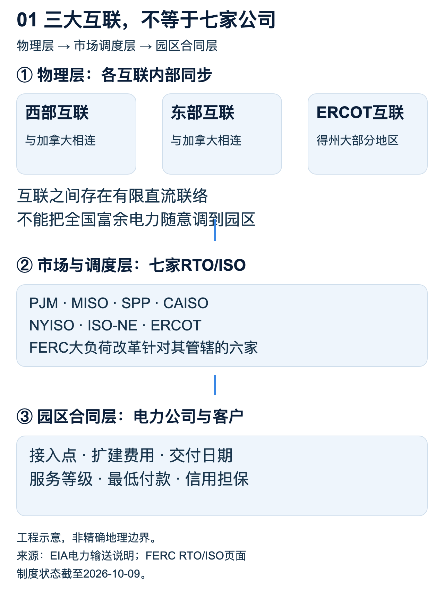
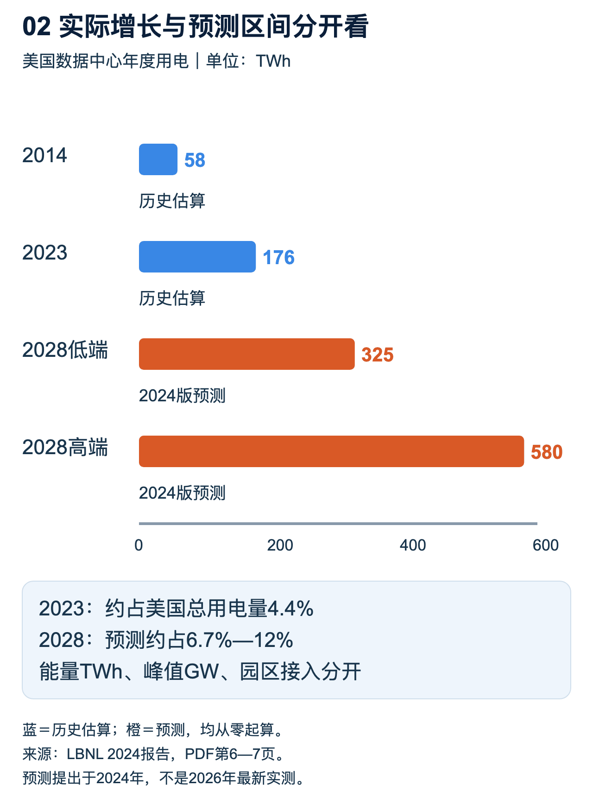
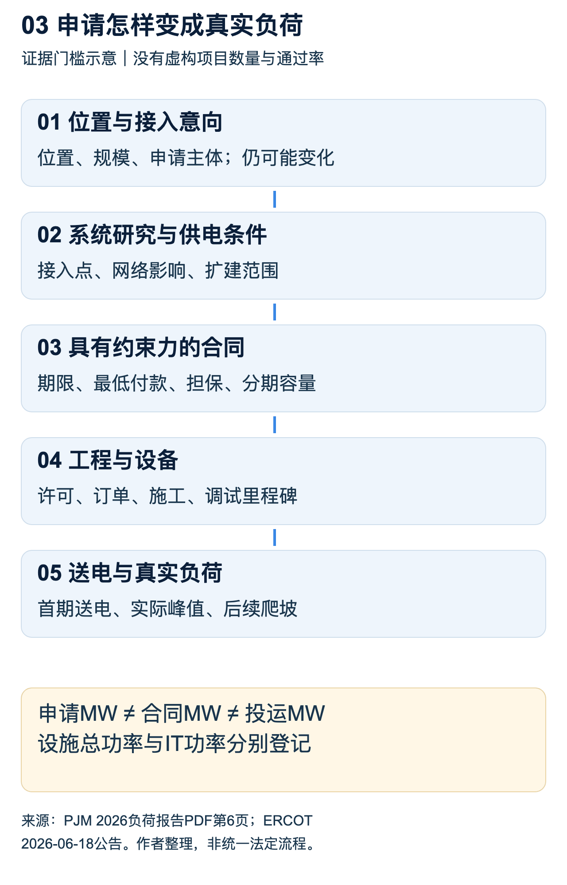
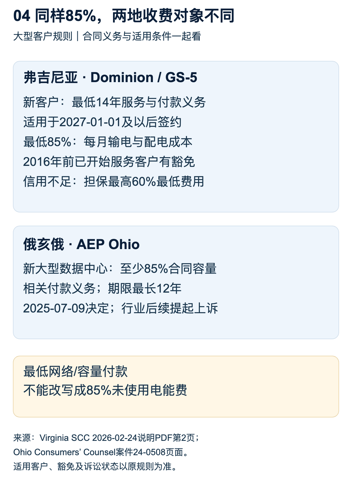
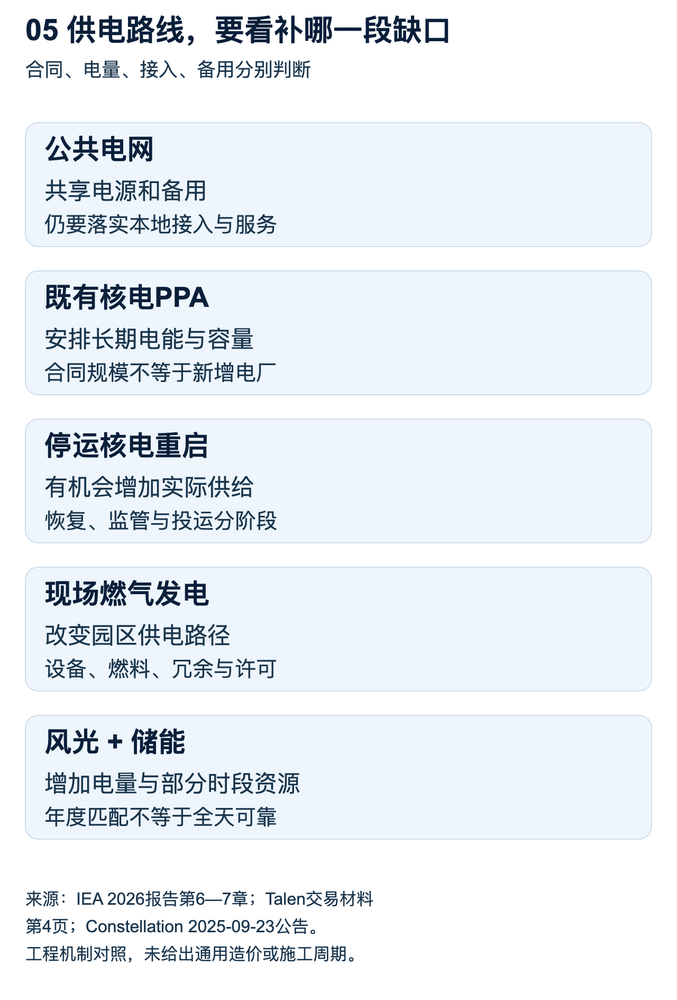
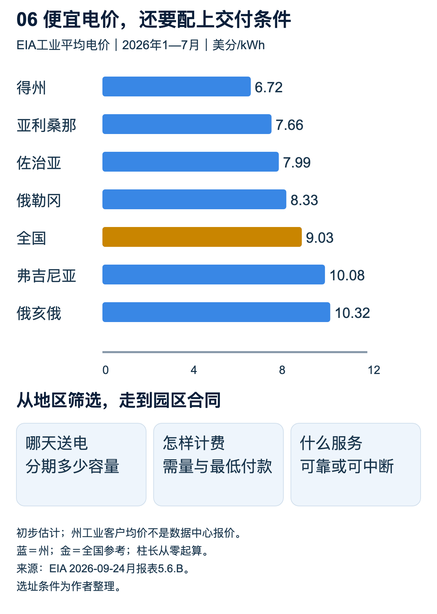

# 美国数据中心的电力现状：缺口在哪里，谁来补，谁付钱

格洛可｜2026年10月9日

美国数据中心的扩张，正在把电力从一张运营账单变成项目的入场券。买到服务器、拿到土地、签下客户，都不足以保证一座算力园区如期开业。最后还要有人把足够的电，在约定的年份送到约定的地方，并且承诺在天气最坏、系统最紧张的时候仍然能够供给。围绕这项承诺，电网运营商、电力公司、州监管机构和科技企业正在重新谈条件。[2][5][6]

这场变化不能用一句“美国缺电”解释。需求增长有实际基础，接入申请却包含大量尚未兑现的项目；一个地区可以拥有充足的年度发电量，仍然没有能力在某个变电站承接新增负荷；一家企业可以买下长期核电合同，仍然需要电网输送与备用。真正决定数据中心进度的，是需求、工程、合同和监管能否在同一时间对上。谁能把这几件事组织起来，谁就能把纸面上的算力变成可交付的算力。[5][13][14]

本篇覆盖：美国电力与数据中心底图、需求及项目真实性、地区瓶颈、成本分担、供电路线、布局变化。

## 第一章　美国电力底图：增长的需求压向三张电网

谈美国数据中心用电，先要把地图看清。美国本土连续的四十八个州主要分属东部互联、西部互联和得州的ERCOT互联三大电力系统。每个系统内部的交流电网同步运行，系统之间没有全国统一的同步网络。东、西两大系统还与加拿大相连，得州互联覆盖的是得州的大部分地区，并非整个州的每一寸土地。阿拉斯加和夏威夷不在这张本土互联地图里。[1]

这三大系统之间有有限的直流联络，可以交换电力。因此，“彼此完全不通”并不准确；准确的说法是，跨系统交换能力有限，无法把任何地方的富余电力随意搬到任何缺电地点。直流联络相当于不同同步系统之间的受控接口，能交换多少、何时可以交换，取决于设备容量和运行条件，不能照搬同一张交流网内部的调度方式。[1][6]

图1｜区域关系为工程示意，不表示精确地理边界。三大互联是物理层，七家RTO/ISO是市场与调度层，客户供电合同属于第三层。

不过，三大电网不是全部问题。物理互联之下还有市场与调度体系，市场与调度之下又有具体电力公司的服务区。数据中心签合同的对象，未必是负责区域调度的机构；负责区域调度的机构，也未必拥有发电厂或地方配电资产。把这几层合成一个“美国电网”，很容易在讨论接入、定价和成本责任时找错对象。[1][2]

美国常说的七家RTO/ISO，分别是PJM、MISO、SPP、CAISO、NYISO、ISO-NE和ERCOT。它们组织区域输电调度或批发市场，承担的职责和覆盖范围各有差异。它们不是七家包办发电、输电、配电和零售的垂直垄断企业，也没有把全美国每个地方都纳入同一种竞争市场。FERC列出七家机构，而2026年6月的大负荷改革命令针对其管辖的六家，ERCOT不在这组六家之中。[2]

区域调度与批发市场的作用，是把发电资源、输电约束和负荷需求放到共同规则下协调。在这一层，价格可以反映电能供求，也可以包含容量、输电及辅助服务安排。地方电力公司则面对另一套任务：线路由谁建设，变电站如何扩建，客户接入需要什么工程，最终账单采用哪个费率。一个园区即使找到了愿意卖电的发电商，也要继续解决送电与接入。[1][2]

电力公司数量多，也不等于所有公司在每个地方争夺同一个客户。投资者所有的公用事业、市政公用事业、合作社、独立发电商和零售供电商，可以分别承担不同角色。地方网络通常有明确服务范围，零售选择权则随地区制度变化。因此，描述美国电力现状，不能把企业总数直接写成统一竞争程度，更不能由此推断某座园区可以随时换一家送电线路。[1][2]

地区差异因此很大。进入PJM区域，项目要理解区域资源充足性和输电服务规则，也要理解地方公用事业与州监管的要求；进入ERCOT区域，项目又要面对得州自身的市场、接入和大负荷管理制度。把一个州的工业平均电价与另一个州相比，只看到了结果的一部分，看不到客户将采用哪种服务、需要建设哪些资产，以及愿意承担哪些中断风险。[5][6][8]

这一结构有历史来源，但不宜把法律沿革讲成一个简单的“各州不愿统一”。1935年对《联邦电力法》的修订，是联邦监管跨州输电与电力批发的重要法律基础。《公用事业控股公司法》同样出台于1935年，处理的重点是公用事业控股公司的组织和监管，不能拿它替代前者来解释批发与零售的权限分工。零售供电和地方公用事业监管通常仍有重要的州级权限。[1][2]

跨州输电线路确实会碰到多层审批：路线、土地、环境、相关州的选址规则，以及涉及联邦土地等条件下的联邦手续。土地所有者和社会团体能够通过土地权利、公众参与或诉讼影响项目，但并不都是拥有同一种法定批准权的“审批部门”。联邦也存在促进输电与特定条件下介入选址的机制。问题在于，协调这些权利和程序需要时间，远比画一条连接两个地区的线复杂。[3]

对于数据中心来说，这些制度差异最终会落到一份具体交付承诺上：哪家电力公司承担供电义务，哪个变电站供电，哪条线路需要扩建，谁批准投资进入费率，客户承担多少最低付款，容量什么时候分期释放。全国政策能改变方向，却不能替代这份园区级合同。开发商真正需要的电力地图，应当画到供电服务区和接入点，而不是止于州界。[5][8]

美国的数据中心也没有均匀地铺在这张地图上。弗吉尼亚州议会联合审计与审查委员会2024年的研究，把北弗吉尼亚列为全球最大的成熟数据中心市场之一。当地集聚的价值不仅在建筑数量，还在网络连接、客户、配套服务及已有建设经验。一个成熟集群能够降低新项目寻找客户和建立连接的难度，也会让新增电力需求持续压向已经密集使用的地区。[7]

成熟集群还有存量与增量的差别。已经接入的机房拥有现成的供电条件，新园区即使与它隔街相望，也可能触发新的网络投资。买下一个已有供电合同的设施，与在旁边买一块土地重新申请，不是同一种资产。项目估值因而需要看既有权利是否可转移、扩容能否获得批准，以及原合同的容量与服务条件能否支撑新的设备密度，不能只看建筑面积和位置。[7][8]

这种集聚产生了一个容易被忽略的现象：全国数据中心用电占比，与某个供电区承担的数据中心压力，可能相差很大。全国平均数把数据中心少的地区和集中的地区放在一起，地方规划却必须处理客户集中接入的时间与地点。北弗吉尼亚的困难不能通过全国平均数抹平，也不能反过来被当作全美国所有园区的同一状态。[7][14]

讨论“美国数据中心现状”，也不宜把机房数量当成最重要的刻度。企业自用机房、云园区、托管设施和AI训练集群，规模、负载和运行要求不同；小型机房很多，并不意味着它们在新增用电中同样重要。对电力系统更有用的问题是，哪类园区正在增长、需要多少总设施功率、什么时候形成真实负荷，以及能否在紧张时段调整运行。[4][13]

同样，一个园区披露的“MW”还需要追问指的是什么。它可能是购电合同规模、接入额度、变电设施容量、园区总负荷，或真正供服务器使用的IT功率。电网服务整个设施，除了服务器，还包括冷却、供配电损耗和其他运行设备。没有说明容量口径，便把公告里的MW全部累加成“AI算力规模”，就会把不同对象放进同一个账本。[4][11]

设施效率指标PUE，把设施总能耗与IT设备能耗联系起来，但它也有使用边界。年度PUE可以帮助换算年度能源，不能未经检查直接把年平均值用作所有时刻的峰值系数。冷却负荷会随环境和运行条件变化，园区的备用设施配置也不是实际同时消耗的功率。研究IT规模、电力账单和接入容量时，需要把年度能耗、峰值负荷和设备冗余各自保留。[4]

这也是本文的出发点：美国电力体系提供的不是一种全国统一、随买随用的商品。数据中心购买电能，同时也在购买地点、时间、可靠性和服务权利。三大互联解释了全国调配的边界，区域市场解释了系统协调的方式，地方合同解释了项目最终能否落地。后面所有关于缺口、成本和迁移的讨论，都要回到这三个层次。[1][2][8]

美国数据中心的用电增长已经越过了可以忽略的阶段。伯克利国家实验室2024年发布的研究，估算美国数据中心2023年用电为176TWh，约占美国总用电量的4.4%；2014年的估算为58TWh。这是一套对行业历史用电的研究估算，覆盖数据中心整体，并非只统计AI，也不是全美国所有机房电表的直接汇总。[3][4]

同一报告把2028年的美国数据中心用电估算放在325—580TWh之间，对应美国总用电量约6.7%—12%。这个区间本身就在提醒读者：未来负荷并非一个已经确定的单点。服务器出货、不同设备的使用率、AI需求和设施效率共同影响结果。高端芯片更费电只是增长机制的一部分，设备有多少、运行多久、承担什么工作，同样决定全国最后消耗多少电。[3][4]

图2｜单位TWh。2014、2023为LBNL历史估算，2028为2024年报告提出的预测区间；柱长均从零起算，不将预测画成已发生。

这组全国数字解释了为什么电力行业必须认真应对，但不能直接回答某个园区什么时候有电。TWh是一个时期内消耗的能量，MW或GW是某个时点的功率。一个全年平稳运行的负荷，与只在有限时间运行的相同额定功率，年度用电不同；电网为了应对系统高峰，还要看它是否与其他负荷同时出现。能源规模、峰值容量和接入能力应分别讨论。[1][4]

做一个说明性计算：假设某园区全年总设施负荷始终为100MW，一年按8760小时计算，年度用电就是0.876TWh。这个换算只把固定负荷变成年度能量，不代表真实园区的服务器利用率，也不包含开业后逐年装机的爬坡。若把规划终期功率从第一年起都按满载计算，既可能夸大眼前用电，也可能误判收入和电费的兑现时间。

国际能源署2026年4月的新报告，进一步解释了需求增长和不确定性为什么同时存在。AI相关设施的扩张很快，单次任务的能效也在改善；更低的单位使用成本可以扩大应用，而更复杂的模型和任务又会增加计算量。总用电最终取决于效率和使用量的共同变化，不能从某个模型一次推理更节能，就推出整个数据中心行业将停止增长。[13]

## 第二章　最难的缺口，在地区和接入点上

一家数据中心可以听到三种都叫“电不够”的回答。第一种是区域在关键时段缺乏足够可靠的发电资源；第二种是区域有发电，但输电通道受限；第三种是上游条件具备，园区接入所需的线路、变电站或设备还没完成。这三种约束需要不同的解决办法。买一份能源合同可以改变采购组合，却无法自动增加最后一段线路的输送能力。[1][7][14]

发电资源是否够，不能只看电厂装机铭牌。电力规划要考虑设备检修与故障、天气、燃料，以及风光资源在紧张时段能贡献多少。不同资源对年度电量的贡献，与对高峰可靠供电的贡献并不相同。NERC的评估把容量与能量风险放在一起分析，就是为了避免用总装机数字掩盖特定时段的不足。[14]

输电则有自己的空间约束。电流并不会因为买卖双方签了合同，就只沿他们想象中的一条线路走；区域潮流、线路限额、故障后的运行安全都会影响可交付电力。电厂附近出现新增负荷，和远处出现同样规模的负荷，对系统造成的影响不同。因此，“这个州有多少发电”与“这个园区可不可以接入”，从来不是等价的问题。[1][2]

可靠性要求还会让“看起来有空余”的网络无法全部用于新客户。正常运行时线路可能没有满载，规划仍需考虑某条线路或设备退出后的状态；园区若要求高可靠服务，就必须纳入这种故障条件。工程冗余与闲置浪费不是同一个概念。判断存量网络可以承接多少新增负荷，需要系统研究，不能把某一时刻的低利用率直接乘成可售容量。[1][14]

北弗吉尼亚的典型矛盾，是成熟数据中心集群继续吸引需求，而电力扩建要沿着现实的地区网络推进。JLARC的研究讨论了新增发电、输电建设、审批和居民成本等约束。成熟市场原本具有连接与客户优势，这些优势又促使开发商继续聚集。结果是，集群越有价值，新增容量越需要系统性扩建，单个园区靠近既有机房也不保证获得相同的供电条件。[7]

把目光放到得州，约束的组合又有变化。ERCOT拥有独立的主要互联系统，新大负荷管理需要结合区域资源和运行安全。2026年6月的新接入研究方式把多个大项目放在共同批次中，说明系统问题已经超出单个客户各自排队的范围。现场自供电、可中断服务和严格的接入条件，成为区域协调新增负荷的工具。[6]

这并不意味着其他地区没有机会。NERC报告覆盖多个北美评估区域，不同区域面临不同的季节性风险、资源结构和燃料限制。新英格兰需要考虑严寒条件下的天然气基础设施，部分中西部地区需要处理负荷增长与可调度资源变化，西部一些地区还要处理水文和风光出力条件。供电优势不会简单地从一个拥堵州平均转移到所有其他州。[14]

在全国层面扩建输电，有助于扩大资源共享，却不能一夜之间把地区瓶颈消除。DOE对输电选址与许可的说明，列出了不同层级和不同土地条件下的程序。线路进入某一地区后，往往还需要相应变电站、保护系统和下游配电配合。上游主干网扩建与园区送电有相关性，但它们不是一份单独的工程，也不必拥有完全相同的完成日期。[3]

设备交期会让这条链条更长。DOE的配电变压器材料记录，2019年的采购周期约为三到六个月，到了2024年可达到一到两年甚至更长。这里说的是配电变压器及当时的调查背景，不能把它当成2026年所有大型主变压器的最新统一交期。它说明了一种真实机制：即使资金和项目许可具备，具体设备规格、工厂产能和交付排期仍可能成为施工进度的约束。[3]

数据中心电力工程还要求设备之间相互匹配。高压接入、变压、开关保护、UPS及机房配电不是随便拼起来的一组库存。先锁定部分设备，可以降低采购不确定性；但在供电方案和园区分期尚未稳定时抢购，又可能造成规格不合、到货与施工不同步，或提前占用资金。供应链紧张提高了早规划的价值，也提高了错误规划的代价。

另一个经常混在一起的概念，是“已经送电”和“全部容量已可使用”。第一期可能获得一部分服务，后续扩容仍等待新线路；变电设施可以按终期建设，服务器却逐步填充；园区也可能先采用可中断服务，再转为更可靠的长期服务。只有把分期容量、服务等级和实际负荷放到同一时间线上，才能知道项目的商业进度是否跟得上电力进度。[5][6]

一座算力园区因此有几只同时走动的钟：客户合同的钟、服务器到货的钟、机房完工的钟、电力送达的钟。最慢的一只决定整体开业时间。服务器先到而电力延误，会占用资金；电力投资先完成而客户迟迟不上线，则会留下利用不足的资产。这不是单纯要求电力公司“动作快一点”就能解决，而是各方需要共同确定负荷与建设里程碑。[5][8]

NERC的风险评估值得重视，但不能把风险图直接翻译成“某地区必然断电”。评估结果取决于所采用的负荷、退役和新增资源假设。报告指出，部分获准加速接入的新发电资源尚未进入评估模型，及时建成可以改善结果。它提供的是在某一信息时点下的压力测试，帮助各方提前行动；后续资源与需求变化，会改变风险的实际大小。[14]

地区瓶颈也不是单纯的市场价格问题。价格提高，可以刺激投资和减少一部分需求；但生产变压器、建线路、获得土地以及调试系统，都有真实工程周期。即时涨价不能在明天变出一座变电站。对数据中心来说，出价能力固然重要，愿意签长期合同、承担扩建费用、提供可信分期负荷，同样可能影响它在供电体系中的可交付程度。[5][8]

这就解释了为什么电价较低的地区，未必对每个项目都便宜。若送电需要更久，或必须先自建发电、长距离光纤及额外备用，低电价优势可能被资本占用和额外投资削弱。相反，一个名义电价高一点、接入条件清楚且送电日期可靠的地点，可能更符合有确定客户与设备交付计划的项目。选址需要比较整套交付成本，而不是一列州平均价格。[1][13]

供电的质量也要写进比较。同样名义容量，一项服务可以在系统紧张时受限制，另一项则需要电力公司为客户安排更完整的资源。可中断服务有机会更快或更便宜，却要求业务真的能够承受对应条件。采购时如果只记住容量和单价，遗漏中断、恢复及扩容条款，企业得到的可用算力就可能与销售承诺不匹配。[5][6]

美国数据中心眼前的电力瓶颈，最终是一个“时间乘以地点”的问题。全国增加发电，有助于改善整体供应；增加跨区通道，有助于扩大互济；扩建地方设施，才把资源送到园区。任何一层进度落后，都会让已有投资等待。因此，判断某项政策或技术有没有帮助，应当先问它缩短的是哪一段路径，而不是把所有“新增电力”当作同一种改善。

## 第三章　项目真实性：申请名单怎样变成用电负荷

判断项目真实性，不能把接入申请原封不动当成需求预测。开发商申请接入时，可能还没有确定全部客户；同一企业也可能在多个地点比较土地与电力条件；一个项目的最终规模和分期计划，可以在融资、供电报价或设备采购后改变。规划部门需要给这些可能性留空间，但如果把每份意向都算成确定负荷，就会为尚未形成的需求建设过多资产。[5][14]

PJM的2026年长期负荷预测，已经把这种差别写进方法。报告说明，在近期预测中，大负荷需要较明确的电力服务义务或建设承诺；远期项目如果承诺较弱，就按更高的不确定性折减。PJM还解释，2026版在2032年以前的预测低于2025版，原因包括电动车、经济因素和大负荷调整。这个修订说明预测需要校准，并不等于当地实际用电已经下降。[5]

PJM同年发布的负荷预测准确性报告，又把已观察到的大负荷峰值与不同年份预测分开展示。报告特意标明，一些分区没有历史大负荷数据；实际月峰值、平均每日峰值和夏季大负荷调整，也不是同一个系列。这类透明度很有价值：市场可以从“预计某年有多大”走向“过去承诺了什么、现在实际实现了多少”，而不是只追逐下一次更大的公告。[5]

负荷曲线还会随着园区填充而变化。供电合同可以为最终规模预留条件，第一批服务器则只产生初始负荷；后续设备与客户逐步进入，才把负荷推向终期。电网若只收到一个最终MW数字，就很难判断哪一年需要什么资产。企业披露分期的价值，在于让客户进场、设备采购和供电扩建同步，而不是给一个很大的终期目标附上含糊的开业年份。[5][14]

项目真实性应当沿建设过程看。最前面是位置和容量意向，往后是研究、供电条件、具有约束力的合同、投资与设备订单、工程进展，最终才是送电和实际负荷。各地流程名称未必相同，但证据强度有明显差别。土地协议证明企业取得了开发条件，购电协议证明双方安排了电力交易，两者都不能单独证明园区已经接入并开始按公告规模用电。[5][6]

图3｜阶段示意，不表示项目数量、通过率或各地统一法定流程。容量按申请、合同、设施总功率与IT功率分别登记。

ERCOT在2026年6月公布的“Batch Zero”改革，从另一侧说明了压力。符合条件的大负荷将进入批次研究，而不是让各项目在相互变化的假设下不断做独立研究。大型项目的接入会改变邻近项目的电力潮流和输电需求，批次协调有助于给多个申请者建立共同的系统基准，减少一个项目修改规模后其他项目反复重算的情况。[6]

这项改革涉及75MW及以上、满足资格条件的大负荷，并提供现场自供电或可中断负荷等路径。ERCOT当时公布的时间安排，把首批最终输电计划放到2027年秋季，后续批次申请也有各自窗口。流程提速并不等于当年所有申请立即有电：研究、建设和投运仍然是不同环节。对企业而言，批次规则会影响谁能进入研究、什么时候知道条件、何时可以获得服务。[6]

北美电力可靠性公司NERC的长期可靠性评估，也直接讨论了这层不确定性。评估使用电力供应实体和规划机构提供的预测，纳入的项目已经超过单纯探询阶段，仍可能因许可、施工、电网开发和企业决定而变化。报告特别说明，PJM和ERCOT后来下调了一部分近期负荷预测，而这些更新由于时点原因没有纳入本次评估。预测有版本，可靠性结论也必须连着版本读。[14]

判断需求真假，最有说服力的反证来自同一项目的前后变化：原来约定的投运日是否延后，终期容量是否下调，第一阶段是否已经送电，是否有真实客户愿意承担最低用电承诺。申请名单里的撤回与推迟，不会自动推翻全行业增长；它们更可能说明扩张受制于交付条件。反过来，一份越来越长的名单，也不足以证明所有项目都有同样的商业基础。[5][14]

还有一种重复发生在机构统计之间。同一园区可以同时出现在开发商公告、地方招商消息、电力公司的负荷预测和电网接入记录里。如果把这些记录当成四个不同项目，行业规模就会被放大。识别时需要核对地址、项目主体、接入点、分期和合同关系；不同法人可能属于同一园区，同一个公司名下也可能有多个真实园区。去重的对象应当是工程与负荷，而不是简单删掉相同的企业名称。

这会改变“缺多少电”的问法。规划部门需要的是不同年份、不同接入点、不同确定程度的负荷分布；企业需要的是在自己开业日期前可以获得的服务；设备制造商需要的是有约束力的订单和交付节奏。全国的需求区间可以给出产业方向，园区级合同与工程证据才决定设备和资本应该排到哪里。把几种信息分开，才能同时避免低估真实增长和高估纸面繁荣。[4][5]

因而，今天最稳妥的判断不是“全部申请都会兑现”，也不是“AI用电都是泡沫”。真实用电已经上升，新增项目在加快争夺供电条件，电网正在更严格地区分近期确定负荷和远期可能负荷。下一轮增长会是多少，仍取决于这些项目能否从申请变成工程，再从工程变成可持续运行的业务。需求很大与兑现很难，正在同时发生。[4][5][6]

## 第四章　电力扩建的账，正在写进数据中心合同

只要扩建电力系统，就要有人先出钱。电力公司可以投资新线路和变电站，区域系统可以安排资源采购，发电企业可以建设电源，数据中心也可以承担接入工程或签长期购电。最终谁承担成本，不只取决于工程由谁建设，还取决于监管允许怎样回收、哪些客户分摊，以及大客户如果推迟或退出，剩余责任由谁接手。[7][8]

公众最担心的情况，是电力公司按大客户承诺建设了资产，客户却没有形成预计用量。部分成本一旦进入公共费率体系，其他客户可能仍要承担剩余回收。在另一种情况下，数据中心确实按计划用电，并通过长期合同覆盖新增成本，它也可以贡献系统固定费用。两种情况并不矛盾，区别在合同强度、实际负荷和成本归集。[7][8][9]

州监管机构正在把这些区别写成更明确的规则。弗吉尼亚SCC在2026年2月公布的说明，列出了Dominion大型客户的新安排：单独的GS-5费率类别、改进成本分摊、最低合同义务、最低付款和信用保障。单列客户类别的意义，是让监管更清楚地识别这类客户造成的成本，而不是继续把增长很快的大客户与一般用户放在同一套平均假设里。[8]

其中，新大型客户如果在2027年1月1日及以后签约，需要至少十四年的服务与付款义务。最低合同年限把电力资产的较长回收周期，与客户承诺联系起来。数据中心服务器和客户业务可以变化，线路和变电设施却不会因为某一代芯片退役便自动消失；长期义务是在告诉客户，它所触发的基础设施不能只由别人承担长期风险。[8]

另一项规定要求适用的大型客户每月至少承担为其服务所发生的85%输电与配电成本，不论实际用电多少；2016年1月1日前已经开始服务的客户有豁免条件。这句话的对象是输配电成本，不能写成“没用的电也按85%全部结算”。固定网络成本和按实际消耗计量的电能费用，是账单中不同的组成部分。[8]

成本分担还有一个必须保留的反例：JLARC在2024年委托的独立研究认为，当时费率总体上已经把现有服务成本适当地分配给包括数据中心在内的客户。它同时担心未来需求增长会提高全系统成本。这说明“现有数据中心少付了自己的费用”和“它们的增长推高边际供电成本”是不同判断。前者需要成本分配证据，后者可能来自更贵的新增电源、输电投资或电力采购，即使没有直接补贴也可能发生。[7]

图4｜弗吉尼亚规则取自SCC说明，俄亥俄州取自消费者法律代表机构对PUCO决定的说明。两地85%的收费对象不同；豁免、生效及诉讼状态不能省略。

对于信用不足的新增客户，SCC说明还列出了覆盖最高60%最低合同费用的担保要求，适用于上述未来签约时点。担保解决的是履约能力：承诺很长，如果签约主体缺乏足够信用，公共系统仍可能面临损失。费率、合同年限和担保配合使用，才能同时处理用量不足、提前退出与付款违约这几种不同风险。[8]

俄亥俄州也有类似方向，却不是完全相同的条款。该州消费者法律代表机构介绍，PUCO在2025年7月9日通过的AEP Ohio数据中心费率，要求新的大型数据中心对所约定电力容量承担至少85%的付款义务，期限最长可到十二年。这里的口径是合同容量相关收费，不能与弗吉尼亚输配电成本的比例直接合并。该机构页面还记载，行业团体在2025年11月提起了上诉。[17]

最低付款会改变开发商的行为。在没有最低承诺时，提前申请较大的终期容量成本可能较低；一旦需要为保留的容量付款，开发商就更有理由把分期计划写实。它必须比较未来客户需求、服务器交付与电力承诺，而不能无限制地占住多个地点的额度。对电网来说，这既是一种成本保护，也是提高需求预测质量的手段。[5][8][17]

从企业账上看，最低付款使一部分电力支出从随业务量变化的费用，转为接近固定承诺的费用。业务利用率下降，服务器的实际能耗可以减少，保留的网络服务与容量付款却未必同比下降。因此，分析一家算力企业的单位成本，应当分别看按kWh计量的能源与按合同或峰值安排的收费。用低利用率去按比例缩小整个电费，会低估空置阶段的现金压力。[8][17]

不过，“数据中心付自己的钱”还需要回答哪些钱算它自己的。园区专用线路比较容易归属，一项同时服务多个地区的主干网扩建、一个改善全系统可靠性的电源，归属更复杂。如果全部压给最新接入者，可能让其他受益者免费获益；如果过度平均分摊，又可能让老客户补贴新项目。成本因果与系统受益，是监管需要同时处理的两面。[8]

2026年3月，白宫发布“Ratepayer Protection Pledge”相关公告，强调大型科技企业应承担相应能源与基础设施成本，避免居民为其扩张买单。它表达了明确的政策方向，但具体付款责任仍要落到州监管决定、电力费率、输电服务及客户合同上。一份全国性承诺不能代替各地已经生效或正在审理的条款，判断保护是否落地，需要继续看实际合同和账单。[15][8]

居民成本确实存在压力，但不能靠夸张个案概括全国。JLARC在2024年的情景研究中，估计到2040年，典型Dominion居民客户与发电、输电有关的月成本，可能增加14—37美元，以不变价计算。这是特定情景下的长期模型结果，不是2026年居民已经普遍发生的电费涨幅，更不是全国居民账单都已翻倍。[7]

同一时期，也有电力公司主张大客户增长可以帮助分摊成本。Georgia Power在2026年8月介绍获批的OpenAI合同及大负荷组合，预计这类客户的新增收入可从2029年起带来每年约9.5亿美元的客户节省。这是公司的未来测算，而且是组合口径，不是单一OpenAI项目已经创造的现金收益。它说明长期合同可以形成另一种分配结果，也说明节省是否兑现要看收入和成本的实际进展。[9]

两种预测放在一起，最有用的结论不是选一个来代表全美国。弗吉尼亚研究强调快速增长下的资源与输电成本，Georgia Power强调有合同约束的大负荷收入对系统成本的贡献。时间、地区、资源组合和合同不同，结果自然可以不同。成本分担的研究应当进入这些具体条件：新增支出多少，客户贡献多少，空置风险谁承担，普通用户最后支付多少。[7][9]

居民的担心也不限于电费。Gallup在2026年5月公布的调查显示，受访美国成年人中，71%反对在自己所在地区建设AI数据中心。调查在同年3月开展，记录的是态度而不是经济影响测量；它不能证明每个地方的电费上涨都由数据中心造成。不过，这种地方接受度会影响审批与政治压力，使企业不得不更清楚地解释成本、水资源、噪声和社区收益。[16]

公司承诺“承担全部成本”，也要看约定边界。专用接入工程、系统扩建、运行中的备用服务和退出后的剩余资产，可能在不同文件中处理。对外公告可以解释原则，完整账单与监管审理才决定责任怎样分配。若合同关键部分没有公开，研究可以确认谁作了什么承诺，但不能据此补出未披露的担保金额、赔偿公式或实际电能价格。承诺的可信度来自后续履约，而非新闻稿用词的强度。[8][9]

成本分担正在成为选址条件的一部分。能承担长期付款与担保的大型客户，更有能力把供电承诺变得可信；缺少稳定客户和资本支持的项目，则更难长期占用公共基础设施。电力合同因此不只是采购文件，也在筛选项目。市场讨论的重点，将从“谁宣布了更大的园区”，逐渐转向“谁愿意为真实需求承担可以执行的义务”。[8][17]

收费本身还会影响项目对电源的选择。公共网络最低付款越强，企业越需要评估自建电源是否真正降低总支出；但保留公共电网备用可能仍然带来收费。若只比较发电设备的燃料成本与公用事业完整到户电价，就把两套不同服务拿来比较。合理的对照应包括投资回收、维护、燃料、备用、排放许可，以及双方共同承担的网络服务。[8][13]

## 第五章　核电、燃气和绿电，各自补的是哪一段缺口

当接入电网变慢，企业自然会寻找替代供电路线。但选择某种能源之前，先要区分电能采购与物理供电。签长期购电协议可以锁定商业关系、价格安排或环境属性，发电厂是否新增、园区是否得到新的接入能力、紧张时段有没有足够电力，仍然需要各自解决。同一份“供电协议”，可能有完全不同的工程含义。[11][13]

核电受欢迎，是因为它可以提供较稳定的低碳电能，适合与长期运行的数据中心建立合约关系。但既有核电合同、退役机组重启和新反应堆建设，属于三种不同供应路径。既有电厂改变售电对象，可以重新分配电能；重启或增功率有机会增加供给；新建则涉及完整的新工程与监管过程。把这些消息相加，会得到一个看上去很大、实际时间与增量都不清楚的数字。[10][11][13]

微软与Constellation围绕Crane清洁能源中心建立的长期购电安排，属于以合同支持停运机组重启的案例。重启对象是原三哩岛一号机组，不是发生事故的二号机组。Constellation在2025年将目标推进到2027年，2026年8月的公司材料披露获得FERC和NRC的关键批准。这个案例可以讨论新增供给和长期客户如何配合，但截至本文时点，应按重启项目与未来目标描述，不能作为已经投运的电力。[10]

这种路线的优势，是可以利用既有场址、部分设备、人员经验和电力系统条件；工作仍涉及设备恢复、监管要求、燃料及运行准备。公司获得某一项许可或某一种融资，并不等于完成全部复运条件。核电重启给数据中心提供的，是一条有明确项目对象和后续里程碑的供应路线，而不是一句“买了核电，明天就不用排队”。[10]

Talen与Amazon的交易，则特别适合用来区分合同与新增发电。Talen在2025年6月披露，扩大后的核电购电安排在全合同规模下达到1920MW，期限至2042年并带有延长选择。公司材料写明，园区将在建立电网连接后转向表前零售安排，过渡期保留部分表后安排。这是既有电厂的长期电能与容量交易，不是宣布新建一座同等规模核电站。[11]

“表前”和“表后”说的是计量与服务安排，不能自动翻译成“公共电网”和“完全不用电网”。一个贴近电厂的园区，仍可能在电厂检修或故障时需要其他资源；它是否从电网取电、取多少、预留什么备用，需要合同和实际配置回答。FERC在2025年12月要求PJM完善发电与大负荷共址的输电服务规则，正是因为原有规则对这类安排的收费与服务条件不够清楚。[2][11]

共址最吸引企业的地方，是有机会缩短物理路径、利用已有电力设施，并让负荷与资源建设同时规划。争议最集中的地方，则是系统责任有没有真正减少：如果平时只向旁边电厂买电，遇到故障仍希望公共电网立即补足全部需求，就不能只按平时取电量来评价需要预留的系统能力。它减少哪种成本、保留哪种依赖，都要经过工程与费率规则的具体分析。[2][13]

现场燃气发电是另一条受到关注的路线。它可以把一部分资源建设移到园区附近，使供电方案更多掌握在项目手里。AEP在2025年6月披露，俄亥俄州批准了在两个数据中心地点部署现场发电资源的项目；批准是一个重要建设条件，却不能代替完成施工和运行测试。企业所谓“自带电源”，需要进一步看发电设备、燃料供给、许可及备用到底落实到哪一步。[18]

这个俄亥俄州案例采用的是Bloom的固体氧化物燃料电池，利用天然气通过电化学反应发电，AWS和Cologix按长期协议承担项目全部成本。它与燃气轮机属于不同设备路线，交付约束、运行维护和具体排放条件需要分别看。共同点在于，都要把燃料送到现场，再把电力交付给负荷；不能把所有现场燃气方案写成采购一台轮机，更不能把应急备用柴油机的配置当成长期主供电方案。[18]

现场电源也要承担可靠性成本。若数据中心需要连续运行，发电机组故障、维护与负荷变化都必须有应对。IEA在2026年的分析中估计，为关键且可变的数据中心负荷提供可靠现场燃气供电，装机可能需要比所服务的需求超配30%—70%。这是报告模型中的范围，取决于配置和可靠性要求，不能套成所有园区统一的固定系数。[13]

图5｜供电机制对照，未给出跨项目通用造价或工期。PPA、共址、自发电和可靠容量分别判断，不能把合同规模当作新增装机。

IEA还指出，燃气轮机供应约束会影响现场电源建设，因此自建不一定比电网供电更快。它对相关美国项目的卫星观察显示，当时约五分之一进入土地清理或建设阶段。这是工程活动的观察，不是投运比例；报告对2030年全球数据中心现场燃气装机给出15—27GW预测，并注明主要增长在美国。已经动工、计划未来投运和正在发电，是三种不同状态。[13]

天然气本身也不是没有网络依赖的能源。电站除了机器，还需要可用的燃料运输条件；冬季紧张时，电力和燃气系统可以同时承压。NERC把天然气与电力行业的协调列为可靠性工作的重要部分。现场燃气可以改变电力接入路径，却会增加对燃料合同、管道和现场运行团队的要求，企业要把这套新责任一起算入方案。[14]

风电、太阳能与储能，可以提供新电量、改善供电组合，并在适当条件下承担部分时段的资源需求。但一份按年度电量匹配的可再生能源PPA，不等于园区每个小时都得到相同来源的电。风光出力随时间变化，储能能支撑多久取决于功率与能量配置。解决年度能源与解决全天可靠运行，可以相互配合，却不能只靠一个年度匹配比例完成。[13][14]

储能也有两个不同的数字：MW描述放电功率，MWh描述储存能量。说明性地忽略损耗，以能量除以功率可得到额定放电时长；实际可用时长还受荷电状态、效率和运行策略影响。用于跨过短时系统高峰的电池，与用于连续多日供电的能源安排，面对的投资和充电条件不同。将一项大功率电池公告直接描述成园区全年能源已经解决，会跳过最关键的能量与时间问题。[13]

Alphabet收购Intersect，显示科技企业正在更深入地组织能源与数据中心开发。2025年12月的协议公布了47.5亿美元现金加承担债务的安排，涉及约定范围内的数据中心与能源开发资产；Alphabet在2026年4月的财报电话会上确认交易于3月完成。这个进展应按已完成收购描述，但被收购组合中仍处于开发、建设阶段的项目，不能因此全部变成已投运容量。[12]

这类整合的意义，不是给科技企业贴上“发电商”的新标签，而是把电源、土地、接入和负荷的开发时间表放到更靠近的组织中。若电源建成而园区未准备好，或者园区建成而资源未到位，资本都会等待。统一组织可以减少部分协调成本，同时也会让科技企业承担更多能源工程、投资和运营风险。它仍需要遵守所在区域的系统规则。[12][13]

小型模块化反应堆等新技术，提供的是更远期的选择。评价一项协议，需要看到实际场址、监管进度、设备与燃料条件、融资、施工以及可执行的交付节点。已有核电长期合同、停运机组重启和新型反应堆商业化，不宜混成“核电正在立刻替代电网”的一个故事。不同路线各有价值，最终比较的是在园区需要的年份能交付多少可靠电力。[13]

电网供电仍然有很强的经济价值：它共享多种资源和备用，而一个独立园区必须自己组织相应能力。现场发电、核电PPA、可再生能源及储能并非互相排斥，一座园区可以采用组合方案。选择哪条路线，取决于缺的是电量、接入、关键时段容量，还是交付时间。把这些缺口分别识别，才不会把昂贵的备用当成廉价电量，也不会把绿色合同当成物理送电能力。[13]

## 第六章　算力开始沿着可交付电力重新布局

当电力成为项目时间表的关键条件，选址的排序就会改变。过去成熟网络、客户集聚和土地条件可以把项目拉向既有数据中心市场；现在，供电服务是否可靠、扩建是否明确、合同成本是否可控，正在获得更高权重。成熟集群仍有优势，但新增项目需要比较的，不再只是地址的知名度，而是整个园区在某个年份能否真正开始营业。[7][13]

州平均电价可以作为第一轮筛选。EIA在2026年9月公布的月报显示，同年1—7月，得州工业平均电价为6.72美分/kWh，弗吉尼亚为10.08美分/kWh。这是州级工业客户的平均收入除以售电量，属于月度统计的初步估计，不是两地任意数据中心都能拿到的报价。电力公司可能按行业或费率阈值分类客户，数据中心不必全部归入工业部门。[1]

图6｜上部为2026年1—7月EIA工业平均电价，单位美分/kWh、初步估计；下部为作者整理的选址条件，不把州均价当作园区合同报价。

如果继续比较，需要把电能费、容量或需量费、输配电、燃料调整、专用工程、担保以及可能的最低付款分开。表面上便宜的电能单价，可能伴随较高的峰值收费；园区还可能为提前获得服务承担现场电源。更完整的账单能改变州平均价格所给出的第一印象，因此，研究“哪儿电便宜”应当尽快进入具体服务区与费率，而不是停留在排行榜。[8][17]

同一期EIA数据中，亚利桑那工业平均电价为7.66美分/kWh，佐治亚为7.99，俄亥俄为10.32，俄勒冈为8.33，全国为9.03。这些差别支持进行地区比较，却不支持把一座园区的报价精确推算出来。州平均值会受到客户结构、实际用量和收费安排影响。若下一步要把比较用于算力成本模型，就应收集具体电力公司的适用费率、接入电压、需量计费和合同义务，并把这些条件与价格一起保存。[1]

说明性地把时间加入账本：如果设备、建筑或已投入资本在等待送电，资金成本就与等待期相连。简单模型可以写成“占用资本×年资金成本率×等待月数÷12”，这里只估算资金占用，不包括收入损失、设备贬值，也不自动代表净新增损失。真实比较应以按期和延期两套现金流为基准，避免把同一项影响在利息、折旧和利润中重复计算。

选址重排也会按工作负载发生。需要接近用户并满足响应要求的业务，对网络时延和服务区域有具体条件；某些可批处理的计算，则有更多调整时间与地点的余地。它们都需要电，但允许中断多久、能否推迟任务、数据能否方便移动，差别很大。不能从“训练可以调度”推导出所有在线推理和企业系统都能无成本地随电价迁移。[12][13]

Google在2025年公布了与Indiana Michigan Power和TVA的需求响应合作，并介绍调整部分机器学习工作负载的做法。它也披露此前与OPPD开展的演示。关键变化在于，数据中心可以把一部分计算安排纳入电力系统协调，在紧张时段降低负荷。这里的资源是实际可调度的工作负载，而不是对外承诺所有服务随时停止。[12]

需求响应为什么有价值，可以从系统高峰解释。电力系统为少数紧张时段准备额外资源，平时并不总需要这些能力；如果一部分负荷在那些时段可靠下降，便有机会减轻新增资源与网络压力。企业为此付出的，则是任务推迟、设备利用率变化、备用安排和调度成本。优惠或补偿必须与企业实际可以提供的灵活性相匹配，纸面“愿意配合”并不足够。[13]

灵活性也需要核验。能够下调多少功率、提前多久通知、一次可以持续多久、一年允许多少次，以及恢复负荷时是否形成新的高峰，都影响系统得到的实际帮助。承诺一部分计算可以延后，与证明每次紧张事件都能按要求执行，之间还有运营距离。电网需要可测量、可调度的响应，企业则需要把补偿与失去的计算产出放到同一本账里。灵活服务越普及，这套合同和测量就越重要。[12][13]

PJM截至2026年10月的公开页面，已经把“自带新增容量”与另一等级服务放到新的大负荷框架中。其IRAS方案希望允许提供新增电力资源的大客户接入，也为没有自带资源的客户安排替代服务条件。页面明确标为等待FERC批准，相关登记工具预计2027年2月上线，按区域汇总的公开信息预计3月提供。提案和未来工具不能当作已经全面实施的制度。[5]

这种制度方向与ERCOT的批次研究和现场自供电路径可以连起来看：新增负荷越来越需要说明自己怎样进入系统，是带来新的资源、接受部分时段约束，还是等待完整可靠服务所需的扩建。各地办法不同，却共同把供电从一个笼统的接入申请，拆成可执行的条件。未来布局将受到这些条件影响，而不只是受到发电资源的地理分布影响。[5][6]

这也可能使不同规模企业的竞争条件发生变化。能签长期合同、提供担保、共同开发电源的客户，拥有更多组织方案；资金与客户确定性较弱的开发商，更依赖已建成的托管设施或现成供电条件。这是一种从合同与工程机制出发的判断，不意味着规模大的企业一定成功。大项目自身也面临协调更多设备、客户和资源的困难。[8][12]

对成熟市场，合理的结果未必是全面撤离。一部分项目继续为连接、客户和产业配套支付较高成本，一部分新增负荷转向供电条件更好的外围或其他地区，还有一部分采用分期与灵活服务。选择会随业务类型变化。更值得观察的是新增投资怎样分配，而不是用某一个新园区的公告宣布旧中心失去价值。[7][13]

对接收新增项目的地区，便宜土地和电价也不够。它需要知道大客户何时形成负荷，怎样覆盖新资产成本，若项目退出如何处理，并确认网络、用水及地方建设条件。抢到一个大型项目，只有在合同和资源都能持续兑现时，才会变成稳定收益。Georgia Power对未来节省的预测，和弗吉尼亚对成本分摊的保护，恰好说明招商与风险约束需要一起设计。[8][9]

Georgia Power披露的2026年OpenAI合同，包含3200MW新增需求及最高1000MW灵活需求响应承诺，并表示客户承担服务所需基础设施成本。它把规模、扩建责任和负荷调整放到同一案例中，能说明新合同怎样组织资源；公告中的需求是合同安排，灵活性也是承诺，均不是已经实现的园区IT负荷。后续应看工程分期、送电、客户用量及响应执行，而不能仅凭合同总规模认定新增算力已经形成。[9]

接下来，判断美国数据中心电力格局，最有信息量的指标会更具体。负荷预测的年度修订，能反映项目兑现程度；园区第一期送电与实际负荷，能反映真实增长；电力公司新增投资与最低付款，能反映成本责任；核电重启、燃气设备与输电工程的里程碑，则能反映供给是否赶得上。它们比全国申请总量更贴近行业真正的转折点。[5][6][10][14]

对外披露越完整，行业越有可能把长期需求变成稳健投资。客户并不需要公开每一项业务机密，但可以让供电规划看到可执行的负荷阶段，让监管看到足够的履约保障。电力公司也需要把工程条件与成本责任解释清楚。提高这类信息质量，比把远期申请不断包装成确定增长，更有助于让项目找到可以融资、可以建设、可以运营的路径。[5][8]

未来几年也有可以对照的时间节点。弗吉尼亚新客户长期义务适用的签约时点、PJM计划中的登记工具、ERCOT公布的批次输电计划、Constellation的重启目标，各自落在不同制度和项目链条中。观察时应当逐个核对是否完成、是否延期、最终条件是什么，不能把这些日期相加成一个全国新增供电目标。[5][6][8][10]

美国数据中心的布局变化，最终取决于哪儿能够把几种稀缺条件组合起来：真实客户，能融资的长期合同，清楚的供电责任，以及按时完成的工程。电能本身重要，能把电在对的地方、对的时间交付，同样重要。接下来更有价值的园区，可能不是公告容量最大的一座，而是客户、设备、网络和电力都能在同一张进度表上兑现的一座。

## 格洛可点评

电力正把数据中心竞争从单纯的设备投入，拉向资源组织与风险承担。区域系统提供共享能力，地方电力公司承担工程，科技企业提供长期需求，居民则关注成本与环境影响。谁先建设、谁承诺付款、谁承担退出风险，决定了收益如何分配。长期合同可以帮助融资和扩建，也会筛掉一部分只愿意保留选择权、不愿意承担兑现责任的项目。

弗吉尼亚的独立费率与长期义务、俄亥俄州的最低容量付款、得州的批次研究，以及Google对能源开发与负荷调度的投入，表明这场变化已经进入具体安排。它们的共同方向，是把需求真实性和新增供给放到同一套责任中。不同地区的结果仍会不同，取决于各自的资源、网络、合同与客户，不能用一个全国平均数代替。

美国的电力约束会影响AI扩张的速度和地点，却不会只产生“建不成”一个结果。项目可以分期、迁移、购买现有服务，或参与新的资源建设；这些选择都有成本。真正需要盯住的是，申请能否变成负荷、合同能否变成收入、工程能否按期送电，以及扩建费用有没有被放到可以承担它的主体账上。这几件事的兑现速度，会决定下一阶段算力供给的实际边界。

## 来源

[1] 美国能源信息署（EIA）。

[2] 美国联邦能源监管委员会（FERC）。

[3] 美国能源部（DOE）。

[4] 劳伦斯伯克利国家实验室（LBNL）。

[5] PJM Interconnection。

[6] 得州电力可靠性委员会（ERCOT）。

[7] 弗吉尼亚州议会联合审计与审查委员会（JLARC）。

[8] 弗吉尼亚州公司委员会（SCC）。

[9] Georgia Power。

[10] Constellation。

[11] Talen Energy（含向SEC提交的公司材料）。

[12] Google、Alphabet与Intersect。

[13] 国际能源署（IEA）。

[14] 北美电力可靠性公司（NERC）。

[15] 美国白宫。

[16] Gallup。

[17] 俄亥俄州消费者法律代表机构（Ohio Consumers’ Counsel）。

[18] American Electric Power（AEP）。

## 备注

资料截至2026年10月9日。LBNL全国用电数字采用2024年研究版本；2028年区间属于该版本预测。EIA州电价采用2026年1—7月工业部门平均口径，不等同于数据中心报价。JLARC的居民成本来自2024年长期情景；Georgia Power的节省来自2026年公司预测。合同容量、装机、园区总负荷与IT功率不互相替代，时间目标不等同于投运。

供电机制图和选址比较属于作者整理；固定负荷与等待资金成本的公式是说明性计算。正文没有采用尚未追到可靠原文的全国接入申请总量、各州暂停项目日期或“全国居民电费翻倍”等说法。全文来源链接、原件身份、关键摘录和未解决问题随研究材料交付。

格洛可
